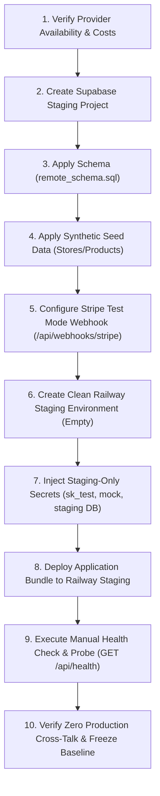

# POST-LAUNCH 20 (PL20-03F): Isolated Staging Architecture Plan

**Date:** 2026-09-19
**Mode:** READ-ONLY / DESIGN ONLY
**Evaluated Main Commit:** `52a48e6f1e36d9ef1d04133989c99c8bda7ddaf6`
**Recommendation State:** `NO_INFRASTRUCTURE_CREATED_DESIGN_ONLY`
**Phase State:** PL20-01 PASS / CLOSED; PL20-02 PASS / CLOSED; PL20-03A PASS / CLOSED; PL20-03B PASS / CLOSED; PL20-03C PASS / CLOSED; PL20-03D PASS / CLOSED; PL20-03E1 PASS / CLOSED; PL20-03F PASS / CLOSED; PL20-03G PASS / CLOSED; PL20-03 ACTIVE; PL21 NOT STARTED
**`finalScaleReady`:** Strictly `false`
**Result:** `PASS / CLOSED`

---

## 1. Executive Summary & Objective

In phase **PL20-03D**, a comprehensive discovery of the production infrastructure established the formal finding:
```text
NO_ISOLATED_REMOTE_ENVIRONMENT
```
Specifically:
1. **Railway:** Only one environment exists in project `heroic-solace` (`2ee53291-c0b1-4859-9ae6-8e331d1f6435`): `production` (`b4af6a5d-c5fb-45bb-b0c6-b5c13ebb1997`).
2. **Supabase:** Only one database project exists: `dporfgsbwsyqzmlnqrug` (the live production database).
3. **Stripe:** The account operates exclusively in live mode (`SolidBit`).
4. **Resend:** Configured for live transactional emails to store customers.

Executing load tests, stress tests, or remote baseline probes against live production infrastructure is strictly forbidden due to severe operational risks:
- Potential customer transaction interruption or latency degradation;
- Unintended data mutation in the production order/payment ledger;
- Database connection pool exhaustion affecting live shoppers;
- Accidental triggering of live Stripe charges or customer transactional emails.

**Objective of PL20-03F:**
Design the minimum safe, isolated staging environment required for future remote capacity baseline testing. In strict adherence to safety rules, **zero infrastructure is created or mutated during this task**. This document establishes the blueprint, secret boundaries, data seeding strategy, provider isolation, creation runbook, decommission sequence, acceptance criteria, and risk mitigation framework.

---

## 2. Part 1 — Minimum Isolated Architecture Components

To achieve true isolation without operational or financial bloat, the staging environment consists of exactly five non-production components:

| Component | Target Role | Isolation Mechanism | Blast Radius to Production |
|---|---|---|---|
| **Railway Staging Service** | Isolated web server running containerized Node/Express backend and SSR/static frontend | Dedicated Railway environment/service with isolated compute container and distinct public domain | Zero (independent container, isolated memory/CPU) |
| **Supabase Staging Database** | Isolated PostgreSQL instance with complete schema and synthetic catalog | Dedicated non-production Supabase project with distinct project ref and connection pool | Strong isolation if provider availability is verified; project/branch limits are `PENDING_PROVIDER_VERIFICATION` |
| **Stripe Test Gateway** | Isolated payment gateway using test mode only | Stripe Test Mode (`sk_test_...` / `pk_test_...`) with test webhook signing secret | No live payment impact; test-mode cost/ledger specifics are `PENDING_PROVIDER_VERIFICATION` |
| **Resend Safe Sink** | Safe email sink preventing outbound email delivery | `EMAIL_ALLOW_MOCKS=true` internal mock sink; provider sink/test behavior is `PENDING_PROVIDER_VERIFICATION` | Zero real customer delivery when mock mode is active |
| **Synthetic Dataset** | Minimal catalog fixture enabling `SAFE_READ` HTTP endpoints | Purely synthetic store, category, and product records created via DDL/seed | Zero (no customer PII, no production orders, no live tokens) |

---

## 3. Part 2 — Secret Boundaries & Environment Variable Categories

A critical failure mode in staging environments is **accidental credential inheritance**, where a staging service inadvertently reads production secrets from shared environment variables or cloned configurations.

### 3.1 Strict Credential Firewall Rule
```text
Production credentials MUST NEVER be inherited, copied, referenced, or accessible
within the staging environment under any circumstances.
```

### 3.2 Staging Environment Variable Specification

The table below defines every required environment variable for staging, its format, and its mandatory isolation boundary:

| Variable | Staging Requirement | Safe Format / Dummy Example | Isolation Constraint |
|---|---|---|---|
| `NODE_ENV` | Explicitly set to `production` or `staging` | `staging` or `production` | Ensures realistic bundle execution without development mocks unless explicitly enabled. |
| `APP_URL` | Staging public origin | `https://staging-web.up.railway.app` or `https://staging.selfcaresinners.com` | **NEVER** `https://selfcaresinners.com`. Prevents redirecting staging users/webhooks to live site. |
| `API_URL` | Staging API origin | `https://staging-web.up.railway.app` or `https://staging-api.selfcaresinners.com` | **NEVER** point to production domain. |
| `PRIMARY_STORE_SLUG` | Store identifier slug | `selfcare-sinners` | Matches synthetic store record in staging database. |
| `SUPABASE_URL` | Staging Supabase project URL | `https://<staging-ref>.supabase.co` | **STRICT PROHIBITION:** Must NOT contain `dporfgsbwsyqzmlnqrug`. |
| `SUPABASE_ANON_KEY` | Staging Supabase anon public key | Dedicated staging anon JWT token | Dedicated to staging project only. |
| `SUPABASE_SERVICE_ROLE_KEY` | Staging Supabase service role key | Dedicated staging service_role JWT token | Dedicated to staging project only. Never use production service role. |
| `STRIPE_SECRET_KEY` | Stripe Test Secret Key | `sk_test_...` | **STRICT PROHIBITION:** Must start with `sk_test_`. Any key starting with `sk_live_` causes immediate deployment abort. |
| `STRIPE_WEBHOOK_SECRET` | Stripe Test Webhook Signing Secret | `whsec_...` | Generated from Stripe Test Mode webhook endpoint registration (`/api/webhooks/stripe`). |
| `RESEND_API_KEY` | Staging Resend Key or Mock Flag | Omit when mocked, or use a staging-safe value after verification | Must not be the live Resend production key. Resend key naming conventions are `PENDING_PROVIDER_VERIFICATION`. |
| `RESEND_WEBHOOK_SECRET` | Staging Resend Webhook Secret | Dummy/mock value or provider-issued test value after verification | Staging webhook endpoint only. Provider test-secret convention is `PENDING_PROVIDER_VERIFICATION`. |
| `EMAIL_ALLOW_MOCKS` | Mock email dispatcher flag | `true` | Directs `EmailService` to record events as `mocked` in the DB with zero outbound HTTP requests. |
| `EMAIL_FROM` | Staging sender address | Mock/sink sender or allowlisted test sender | Never production custom sending domain. Resend sandbox sender behavior is `PENDING_PROVIDER_VERIFICATION`. |
| `ADMIN_EMAIL` | Staging admin account | `staging-admin@example.com` | Non-operational synthetic mailbox. |
| `JWT_SECRET` | Staging session signing secret | Random 64-char hexadecimal string | Unique secret generated randomly for staging. Must not match production JWT secret. |
| `PORT` | Container listening port | `3000` (or Railway `$PORT`) | Injected by Railway runtime. |

---

## 4. Part 3 — Data Isolation & Synthetic Seeding Strategy

### 4.1 Schema Feasibility: Can Migrations Build Staging From Scratch?

**Assessment: YES.**
The repository contains a fully consolidated declarative schema dump:
- File: `supabase/migrations/20260918004527_remote_schema.sql` (511,068 bytes, 9,934 lines).
- In addition, sequential canonical SQL migrations exist in `scripts/db/` (`001_...` through `043_...`).

Inspection of `20260918004527_remote_schema.sql` confirms:
1. It defines all PostgreSQL extensions (`unaccent`, `uuid-ossp`, `pgcrypto`).
2. It creates all tables, foreign keys, unique constraints, and indexes.
3. It creates the current stored procedures, functions, and triggers present in the baseline. Specifically, `finalize_paid_order` is defined as `SECURITY INVOKER` (not `SECURITY DEFINER`) with immutable `SET search_path = ''` in `20260918004527_remote_schema.sql` (lines 6178–6191) and permissions revoked from `PUBLIC`, `anon`, and `authenticated`, granted exclusively to `postgres` and `service_role` (lines 9199–9201). Do not assert historical function names or attributes unless verified in the current migration.
4. It enables Row Level Security (RLS) across all tables and establishes all security policies.
5. It contains **zero application data, zero customer records, and zero store rows**.

Applying `20260918004527_remote_schema.sql` against a clean PostgreSQL database initializes the schema cleanly without requiring a dump or clone from production.

### 4.2 Safe Staging Seed Strategy (No PII, No Production Data)

Because the schema initializes with empty tables, the application requires minimal synthetic seed data to satisfy approved `SAFE_READ` capacity baseline routes:
1. `GET /` — storefront rendering requires primary store metadata.
2. `GET /api/health` — requires service health verification.
3. `GET /api/readiness` — requires DB connectivity check (`supabase.from('stores').select('id')`).
4. `GET /api/public/store` — requires primary store record.
5. `GET /api/public/home` — requires active store and featured products.
6. `GET /api/public/categories` — requires active category records.
7. `GET /api/products` — requires at least one active store and active products.

*(Note on Product Detail Route: The repository currently exposes `GET /api/products/:id` matching on product UUID. It does NOT expose an `/api/products/:slug` endpoint. If product detail testing is evaluated in future iterations, it should use a known synthetic UUID with `/api/products/:id`, but it is intentionally NOT added to the approved 7-route baseline set).*

#### Minimal Synthetic Seed Specification:
```sql
-- 1. Synthetic Store matching PRIMARY_STORE_SLUG
INSERT INTO public.stores (
  id, name, slug, status, created_at, updated_at
) VALUES (
  '11111111-1111-4111-8111-111111111111'::uuid,
  'Selfcare Sinners Staging',
  'selfcare-sinners',
  'active',
  now(),
  now()
) ON CONFLICT (slug) DO NOTHING;

-- 2. Synthetic Category
INSERT INTO public.categories (
  id, store_id, name, slug, is_active, created_at, updated_at
) VALUES (
  '22222222-2222-4222-8222-222222222222'::uuid,
  '11111111-1111-4111-8111-111111111111'::uuid,
  'Staging Category',
  'staging-category',
  true,
  now(),
  now()
) ON CONFLICT (store_id, slug) DO NOTHING;

-- 3. Synthetic Products (3 items for pagination & catalog testing)
-- Products do not have category_id in the current schema. The categories table
-- is seeded independently; products store category labels in category/categories.
INSERT INTO public.products (
  id, store_id, name, slug, description,
  price, cost, stock, status, is_featured, category, categories, created_at, updated_at
) VALUES
(
  '33333333-3333-4333-8333-333333333331'::uuid,
  '11111111-1111-4111-8111-111111111111'::uuid,
  'Synthetic Serum A',
  'synthetic-serum-a',
  'Synthetic staging product for read-only capacity testing.',
  299.00, 50.00, 100, 'active', true,
  'Staging Category', '["Staging Category"]'::jsonb,
  now(), now()
),
(
  '33333333-3333-4333-8333-333333333332'::uuid,
  '11111111-1111-4111-8111-111111111111'::uuid,
  'Synthetic Cream B',
  'synthetic-cream-b',
  'Synthetic staging product for read-only capacity testing.',
  450.00, 80.00, 50, 'active', true,
  'Staging Category', '["Staging Category"]'::jsonb,
  now(), now()
),
(
  '33333333-3333-4333-8333-333333333333'::uuid,
  '11111111-1111-4111-8111-111111111111'::uuid,
  'Synthetic Cleanser C',
  'synthetic-cleanser-c',
  'Synthetic staging product for read-only capacity testing.',
  199.00, 30.00, 200, 'active', false,
  'Staging Category', '["Staging Category"]'::jsonb,
  now(), now()
) ON CONFLICT (store_id, slug) DO NOTHING;
```

Seed schema verification against `supabase/migrations/20260918004527_remote_schema.sql`:

- `public.stores`: `id`, `name`, `slug`, `status`, `created_at`, and `updated_at` exist. `currency` is not used because it is not a `stores` column in the current baseline.
- `public.categories`: `id`, `store_id`, `name`, `slug`, `is_active`, `created_at`, and `updated_at` exist.
- `public.products`: `id`, `store_id`, `name`, `slug`, `description`, `price`, `cost`, `stock`, `status`, `is_featured`, `category`, `categories`, `created_at`, and `updated_at` exist.
- `public.products` has no `category_id`; products do not declare a foreign key to `public.categories` in the current baseline.

#### Strict Prohibitions:
- **NO Customer PII:** Zero user records cloned from production.
- **NO Orders:** Zero rows inserted into `orders`, `order_items`, or `order_timeline`.
- **NO Payment Identifiers:** Zero Stripe customer IDs, payment intent tokens, or card fingerprints.
- **NO Production Backups:** Strictly forbid restoring production database snapshots into staging.

---

## 5. Part 4 — Railway Architecture & Environment Design

### 5.1 Architecture Options Analysis

Railway supports environments within a project and separate projects entirely.

| Approach | Configuration | Risk of Secret Contamination | Isolation Level | Recommendation |
|---|---|---|---|---|
| **Option A: New Environment in Project `heroic-solace`** | Add environment named `staging` in project `2ee53291-c0b1-4859-9ae6-8e331d1f6435`. Deploy existing service repo under `staging`. | **HIGH** if created via "Duplicate Environment", which copies production variables automatically. Low if created empty. | Shared project scope, separate service instance | **Acceptable with strict controls** (must create from scratch without cloning variables). |
| **Option B: Dedicated Separate Railway Project** | Create new project `selfcare-sinners-staging`. Deploy service repo there. | **ZERO** secret inheritance risk. Complete project-level boundary. | Complete project & organizational boundary | **STRONGLY RECOMMENDED (Strongest Isolation)** |

### 5.2 Prevention of Inherited Variables (The Railway Variable Risk)

When creating a new environment in Railway:
1. **The Trap:** Railway provides a "Duplicate Environment" feature that clones all environment variables from the source environment (`production`). If an operator clicks this, all production database URLs, live Stripe keys, and live Resend tokens are immediately copied into staging!
2. **Mandatory Prevention Rule:**
   - The staging environment **must be created as an empty environment** (`New Environment -> Empty Environment`), **NOT** cloned or duplicated from `production`.
   - Variables must be populated from an explicit staging variable template.
   - Any service variable referencing Railway "Shared Variables" or project-level variables from `production` must be strictly detached.
   - A pre-flight script or manual inspection must verify that `STRIPE_SECRET_KEY` does not start with `sk_live_` and `SUPABASE_URL` does not equal `https://dporfgsbwsyqzmlnqrug.supabase.co`.

### 5.3 Staging Service Configuration
- **Branch / Deploy Source:** Deploys from GitHub `main` (or a dedicated release tag).
- **Service Name:** `web-staging`.
- **Domain:** Dedicated Railway-generated domain (e.g. `https://heroic-solace-staging.up.railway.app`) or dedicated subdomain `staging.selfcaresinners.com`.
- **Compute Tier:** Match production container baseline (1 vCPU / 512MB RAM) to enable valid comparative baseline analysis.

---

## 6. Part 5 — Supabase Staging Design

### 6.1 Option Evaluation: Separate Project vs. Branching

| Architecture Option | Feasibility on Current Stack | Technical Isolation | Production Risk | Recommendation |
|---|---|---|---|---|
| **Supabase Database Branching** | Status: `PENDING_PROVIDER_VERIFICATION`. Branching requires specific plan features and GitHub App integration. In current live configuration, branching is unverified. | Logical branch in managed infrastructure; shares organizational limits. | Low, but branching can accidentally carry data if configured with point-in-time seed. | Infeasible/unverified on current plan. |
| **Dedicated Separate Supabase Project** | Status: `PENDING_PROVIDER_VERIFICATION` (project quota limits subject to current operator account status). | **PHYSICAL & CRYPTOGRAPHIC ISOLATION.** Separate database instance, separate pooler, separate keys. | **ZERO.** Complete blast-radius firewall. | **SELECTED (Strongest Isolation)** |

### 6.2 Implementation Guidelines for Dedicated Project
1. **Creation:** Create a new project in Supabase dashboard (e.g. `selfcare-sinners-staging`) after verifying project quota, plan limits, and region requirements (`PENDING_PROVIDER_VERIFICATION`).
2. **Schema Deployment:** Execute `supabase/migrations/20260918004527_remote_schema.sql` via Supabase SQL Editor or Supabase CLI (`supabase db push --db-url <staging-pooler-url>`).
3. **Seed Deployment:** Execute the synthetic seed SQL from Section 4.2.
4. **Key Capture:** Record `SUPABASE_URL`, `SUPABASE_ANON_KEY`, and `SUPABASE_SERVICE_ROLE_KEY` directly from the staging project API settings into the staging Railway environment.

---

## 7. Part 6 — Stripe Test Mode Isolation

### 7.1 Mandatory Test Mode Safeguards
1. **Strict Key Prefix Enforcement:**
   - `STRIPE_SECRET_KEY` MUST start with `sk_test_`.
   - `VITE_STRIPE_PUBLISHABLE_KEY` (if used on client) MUST start with `pk_test_`.
   - Any deployment where `STRIPE_SECRET_KEY` starts with `sk_live_` must immediately abort container boot.
2. **Webhook Endpoint Separation:**
   - Register a dedicated Stripe webhook in the Stripe Dashboard under **Test Mode**:
     - URL: `https://<staging-app-url>/api/webhooks/stripe`
     - Events listened: `checkout.session.completed`, `payment_intent.succeeded`, `payment_intent.payment_failed`
   - Capture the resulting test signing secret (`whsec_...`) and configure as `STRIPE_WEBHOOK_SECRET` in staging.
3. **No Live Payment Events:**
   - Test mode must remain isolated from live payment events. Test card, test clock, and cost assumptions are `PENDING_PROVIDER_VERIFICATION`.
   - Zero live payment intents, charges, bank payouts, or dispute records are touched.
   - Cost status: `PENDING_PROVIDER_VERIFICATION` until current Stripe account/provider terms are verified.

---

## 8. Part 7 — Resend Safe Email Sink

### 8.1 Email Service Architecture in Staging

In `src/server/email/email-service.ts`, the application contains native mock capabilities:
```typescript
private shouldAllowMockSend() {
  return process.env.EMAIL_ALLOW_MOCKS === 'true' || process.env.NODE_ENV !== 'production';
}
```
When `EMAIL_ALLOW_MOCKS === 'true'`, if `RESEND_API_KEY` is omitted or mock mode is enforced:
1. `EmailService` logs the email event to the Pino logger: `[Email Mock]`.
2. It persists an audit record into the `email_events` table with `status: 'mocked'` and `providerId: 'mock-<uuid>'`.
3. It returns `{ success: true, mocked: true, status: 'mocked' }` without making any outbound network call to Resend.

### 8.2 Staging Email Policy
- **Primary Configuration:** Set `EMAIL_ALLOW_MOCKS=true`.
- **Sender Identity:** Use a mock/sink sender or allowlisted test sender. Resend-specific sandbox sender conventions are `PENDING_PROVIDER_VERIFICATION`.
- **Zero Real Deliverability:** Real customer inboxes are completely firewalled from staging outbound traffic. Even if an automated test triggers an order confirmation, it terminates safely in the internal mock sink.
- **Provider Key Conventions:** Status: `PENDING_PROVIDER_VERIFICATION`. Staging does not rely on live Resend keys.

---

## 9. Part 8 — Preconditions for Future Remote Capacity Baseline Testing

Once the staging environment is provisioned and verified, the following strict preconditions must be satisfied before executing any k6 load test:

### 9.1 Target Hostname & Approved Baseline Routes
1. **Target Verification:** The test runner script MUST be hardcoded to target the staging hostname only (e.g. `https://staging.selfcaresinners.com` or `https://heroic-solace-staging.up.railway.app`).
2. **Production Blocklist:** The harness must contain an active assertion aborting if the target hostname resolves to `selfcaresinners.com` or `www.selfcaresinners.com`.
3. **Exact Approved `SAFE_READ` Routes (7 routes matching local baseline):**
   - `GET /`
   - `GET /api/health`
   - `GET /api/readiness`
   - `GET /api/public/store`
   - `GET /api/public/home`
   - `GET /api/public/categories`
   - `GET /api/products`

### 9.2 Initial Comparison Workload Calculation
- **Workload Definition:** Exactly 1 VU for 30 seconds with 1 second sleep after each route call, matching the current `scripts/load/pl20-baseline.k6.js` harness.
- **Actual Harness Behavior:** The harness iterates sequentially through the 7 `SAFE_READ` routes with a 1-second pause after each endpoint.
- **Reference Request Volume:** The local measured baseline with the current harness produced **35 requests / 30 seconds**.
- **Staging Comparison Rule:** Initial staging comparison should use the same harness parameters and compare against that measured local reference. Do not invent additional rate estimates.
- **Harness Fidelity:** Staging comparison must use the identical harness parameters as the local baseline.

### 9.3 Active Observability & Monitoring
- **Railway Metrics:** CPU usage, Memory consumption (RSS), and HTTP response status distribution actively monitored in Railway console.
- **Supabase Metrics:** Active database connection count and pooler client connections monitored in Supabase dashboard.

### 9.4 Zero Mutation Guarantee
- **Read-Only:** Strictly HTTP GET methods.
- **Prohibited:** No `POST /api/cart`, `POST /api/orders`, `POST /api/checkout`, or `POST /api/webhooks/*`.

### 9.5 Qualitative Stop Conditions (Hard Abort)
The load test must immediately terminate upon encountering any of the following:
- Unexpected or systemic HTTP 5xx responses;
- Any unhandled HTTP 500 internal server error;
- Staging container crash or unexpected restart;
- Material CPU saturation or sustained upward saturation indication;
- Material memory pressure or sustained upward trajectory;
- Database connection refusal or connection pool exhaustion;
- Any unexpected data mutation detected in staging database tables;
- Any external provider side effect (Stripe webhook error, unexpected Resend call);
- Any indication of cross-talk with production systems or customer traffic.

### 9.6 Strict Prohibition
```text
STRICT PROHIBITION:
Under NO circumstances is remote load testing authorized against production.
```

---

## 10. Part 9 — Cost Impact & Operating Cost Accounting

### 10.1 Projected Staging Cost Breakdown

In accordance with PL20 evidence integrity standards:
- **Do NOT invent pricing.**
- **Do NOT present marketing figures as authoritative operating cost.**
- Mark unknown or variable costs as `UNKNOWN / PENDING_OPERATOR_VERIFICATION`.

| Provider | Staging Component | Expected Cost Basis | Status for Accounting |
|---|---|---|---|
| **Railway** | Additional staging container (service) | If existing account has 4 shared hosts under the 192 MXN/month baseline, adding a 5th service or staging environment may consume runtime execution credits or trigger plan tier limits. | `UNKNOWN / PENDING_OPERATOR_VERIFICATION` |
| **Supabase** | Dedicated staging project | Account free project quotas and branching availability are subject to provider tier policies. | `UNKNOWN / PENDING_OPERATOR_VERIFICATION` |
| **Stripe** | Stripe Test Mode transactions & webhooks | Test-mode cost assumptions must be verified against current Stripe account/provider terms. No live charges are allowed. | `UNKNOWN / PENDING_PROVIDER_VERIFICATION` |
| **Resend** | Mock dispatch (`EMAIL_ALLOW_MOCKS=true`) or provider sink/test mode | Internal app mock should avoid provider API calls; provider-specific sink/test behavior and cost remain unverified. | `UNKNOWN / PENDING_PROVIDER_VERIFICATION` |

### 10.2 Strict Cost Separation Principle
Staging costs represent **temporary engineering / testing overhead**, NOT the ongoing commercial operating cost of the store:
1. Staging expenses must **NEVER be merged into the production operating cost evidence contract**.
2. PL20-03E production cost dimensions (`Railway: 192 MXN shared`, `Supabase: 0 MXN free tier`, `Stripe: actual fees total`, `Resend: 0 MXN free tier`) must remain completely separate from staging infrastructure expenditures.

---

## 11. Step-by-Step Creation Sequence (Execution Blueprint)

When ChatGPT Web and the operator authorize infrastructure provisioning, the following sequential steps must be executed:



### Detailed Sequence:
1. **Step 1 — Provider Verification:** Verify Supabase staging project/branch availability, Stripe test-mode requirements/cost assumptions, Resend mock/sink/test behavior, and Railway staging cost before creation.
2. **Step 2 — Provision Staging Database:** Create a new dedicated non-production Supabase project if verified and approved.
3. **Step 3 — Deploy Schema:** Run `supabase/migrations/20260918004527_remote_schema.sql` via Supabase SQL Editor against the new staging database.
4. **Step 4 — Seed Synthetic Data:** Run the synthetic SQL script (Section 4.2) to populate 1 store, 1 category, and 3 test products.
5. **Step 5 — Stripe Test Configuration:** In Stripe Dashboard (Test Mode), create webhook pointing to `https://<staging-domain>/api/webhooks/stripe`. Capture staging/test webhook secret.
6. **Step 6 — Provision Railway Staging:** In Railway project `heroic-solace`, click `New Environment` -> `Empty Environment` (named `staging`) or use a dedicated staging project if approved. **Do NOT clone `production`.**
7. **Step 7 — Configure Staging Secrets:** Add the exact staging variables specified in Section 3.2.
8. **Step 8 — Deploy Service:** Connect Railway staging service to GitHub repository `risejoaquin/stable-ecomerce` (`main` branch) and deploy.
9. **Step 9 — Verification Probe:** Issue manual curl request to `https://<staging-domain>/api/health` and verify:
   - HTTP 200 response
   - `status == "ok"`
   - `environment` identifies non-production/staging configuration
   - `version == expected deployed SHA`
   - DB connection succeeds against staging DB (`/api/readiness`).
10. **Step 10 — Safety Sign-off:** Confirm zero alerts or events in production Supabase, Stripe, or Resend dashboards.

---

## 12. Rollback & Deletion Sequence (Tear-Down Blueprint)

To eliminate unnecessary ongoing costs and minimize attack surface when testing concludes:

1. **Step 1 — Terminate Traffic:** Terminate any running k6 or test processes immediately.
2. **Step 2 — Decommission Railway Service:** In Railway, remove the staging service or delete the `staging` environment. This stops all container execution and prevents resource consumption.
3. **Step 3 — Pause / Remove Supabase Staging Project:** In Supabase dashboard, pause or delete the `selfcare-sinners-staging` project to release organization project quota.
4. **Step 4 — Revoke Stripe Test Webhooks:** In Stripe Dashboard Test Mode, disable or delete the staging webhook endpoint (`/api/webhooks/stripe`).
5. **Step 5 — Verify Zero Dangling Resources:** Confirm in Railway and Supabase consoles that only production resources remain active.

---

## 13. Acceptance Criteria for Staging Readiness

Before declaring the staging environment ready for capacity baselining, all the following criteria must be met:

- [ ] **Architecture Isolation:** Staging runs in an independent container with zero shared compute/memory with production.
- [ ] **Database Isolation:** Staging connects to a separate Supabase project. Production database URL is completely absent from staging configuration.
- [ ] **Schema Fidelity:** Staging database contains all 20260918 schema objects (tables, functions, RLS policies) applied from migrations.
- [ ] **Data Sanitization:** Staging database contains strictly synthetic seed data. Zero customer PII or production orders exist.
- [ ] **Payment Safety:** `STRIPE_SECRET_KEY` starts with `sk_test_`. Live Stripe keys are strictly absent. Webhook registered at `/api/webhooks/stripe`.
- [ ] **Email Safety:** `EMAIL_ALLOW_MOCKS=true`. No real emails are dispatched to external recipients.
- [ ] **Health Check PASS:** `GET /api/health` returns HTTP 200 with `status == "ok"`, `environment` identifying staging, and `version == expected deployed SHA`.
- [ ] **Target Verification:** Load testing scripts target staging domain only; production URL is rejected by safety assertions.
- [ ] **Approved Route Set:** Harness restricted strictly to the 7 approved `SAFE_READ` routes (`/`, `/api/health`, `/api/readiness`, `/api/public/store`, `/api/public/home`, `/api/public/categories`, `/api/products`).
- [ ] **Workload Fidelity:** Initial staging test matches local baseline parameters (1 VU, 30s duration, 1s sleep per route) and uses 35 requests / 30 seconds as the measured local reference.
- [ ] **Production Immutability:** Live production metrics (CPU, error rate, active connections) show zero deviation during staging deployment.

---

## 14. Comprehensive Risk Matrix

| Risk | Severity | Probability | Mitigation Strategy |
|---|---|---|---|
| **Accidental Secret Contamination** (staging inherits production Stripe/DB secrets) | **CRITICAL** | Medium (if using Railway clone) | Strictly create empty Railway environment from scratch; verify keys with regex before boot (`sk_test_*` assertion). |
| **Cross-Database Leakage** (staging modifies production database) | **CRITICAL** | Low | Dedicated Supabase project with distinct URL and credentials; firewall rules prevent cross-access. |
| **Accidental Customer Email Dispatch** | **HIGH** | Medium | Set `EMAIL_ALLOW_MOCKS=true` to terminate email flow in the app mock/sink path; provider-specific test address behavior is `PENDING_PROVIDER_VERIFICATION`. |
| **Accidental Live Stripe Charges** | **CRITICAL** | Low | Hard assertion preventing server start if `STRIPE_SECRET_KEY` does not start with `sk_test_`. |
| **Noisy Neighbor / Production Impact** | **MEDIUM** | Low | Separate Railway container; separate Supabase compute instance and connection pooler. |
| **Unexpected Staging Cost Overrun** | **LOW** | Low | Decommission staging environment promptly after testing. |

---

## 15. Compliance & Next Steps

1. **Current Code & Infrastructure Immutability:**
   - No code in `server.ts`, tests, scripts, or workflows was modified.
   - No remote infrastructure was created or modified in Railway, Supabase, Stripe, or Resend.
   - `finalScaleReady` remains strictly `false`.
2. **Next Steps:**
   - Deliver this architecture plan for ChatGPT Web review and validation.
   - Await explicit operator decision regarding whether to provision the staging environment or proceed with cost evidence intake.

---

```text
READY_FOR_CHATGPT_WEB_VALIDATION
```
