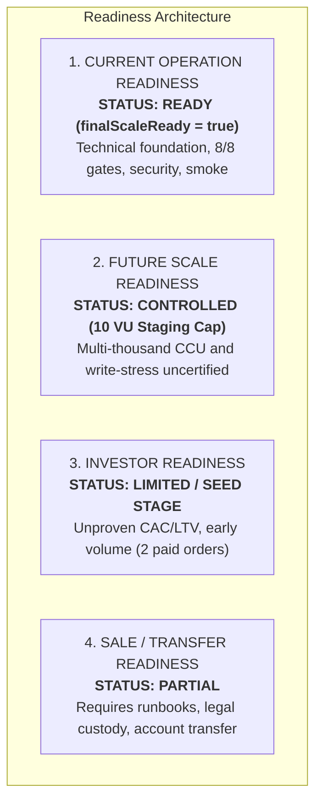

# POST-LAUNCH 20 — DELIVERABLE 8
# Scale Decision Record (Final Evaluation)

- **Date:** 2026-09-22
- **Canonical Commit SHA:** `711d816b329dafbc8d05440029870174477b37a4`
- **Database Table:** `scale_decision_records`
- **Decision Key:** `pl20-scale-decision-record-final`
- **Final Scale Decision:** **`scale_carefully`**
- **Decision Status:** **`APPROVED_FINAL_SCALE_DECISION`**
- **Decision Authority:** ChatGPT Web
- **Decision Date:** 2026-09-22
- **Authoritative Operational Readiness:** **`finalScaleReady = true`**

---

## 1. Governance Separation of Four Distinct Readiness Concepts

In accordance with POST-LAUNCH 20 strict institutional standards, **`finalScaleReady = true` applies strictly to Current Operation Readiness**. It must NEVER be conflated with or reinterpreted as market success, investment attractiveness, unlimited scalability, or corporate sale readiness.

The evaluation explicitly decouples four independent dimensions:

---

## 2. Detailed Dimension-by-Dimension Breakdown

### Concept 1: Current Operation Readiness
- **Evaluation:** **READY (`finalScaleReady = true`)**
- **Evidence:**
  - 8 of 8 required technical dimensions evaluated to `status = PASS`.
  - GitHub Actions Quality Gate Run `35696315104` = SUCCESS (76/76 unit/contract tests, 20/20 E2E suites, 0 lint/TypeScript errors).
  - GitHub Actions Production Smoke Run `35696422693` = SUCCESS.
  - Production read-only smoke (`smoke-final-scale-report.ps1`) = PASS (11/11 endpoints returned HTTP 200, exit code 0).
  - Production health verification (`/api/health`) = 200 OK for exact commit `711d816b329dafbc8d05440029870174477b37a4`.
  - Zero critical technical failures, zero critical risks, zero critical debt items.
  - All security blockers satisfied (reviewed row `e0d3e0e7-8ae6-4f8a-b6c1-3b77e86ac6c3`, open count 0).
- **Scope:** The system is completely robust, stable, and ready to serve live retail customers for standard daily transactions.

---

### Concept 2: Future Scale Readiness
- **Evaluation:** **CONTROLLED / CAUTIOUS (`scale_carefully`)**
- **Evidence Limitations:**
  - Empirical load characterization was conducted on isolated staging up to 10 Virtual Users (833 requests, 0% error rate, sub-500ms p90).
  - High write-concurrency stress (e.g., 100+ simultaneous checkout transactions hitting Stripe webhooks and database locks) has not been tested against production.
  - Production database connection ceiling under high concurrency remains unverified.
- **Strict Non-Claims:**
  - **DO NOT INTERPRET AS UNLIMITED SCALABILITY.**
  - The system is not certified for viral traffic spikes, multi-thousand concurrent users, or unthrottled flash sales.

---

### Concept 3: Investor Readiness
- **Evaluation:** **LIMITED / SEED STAGE (`score: null`)**
- **Evidence Limitations:**
  - Production transaction volume is early: 11 recorded orders, 2 paid orders ($24.00 MXN gross revenue).
  - Zero historical cohorts exist to demonstrate Customer Lifetime Value (LTV), repeat purchase retention, or blended Customer Acquisition Cost (CAC).
  - Advertising channels (Meta Pixel, Google Ads) are structurally ready in code but not connected to live spend.
- **Strict Non-Claims:**
  - **DO NOT INTERPRET AS INVESTMENT ATTRACTIVENESS OR MARKET SUCCESS.**
  - Technical stability is proven; commercial demand, unit profitability, margins, and Product-Market Fit (PMF) are NOT MEASURED / NOT DETERMINABLE from current low-volume evidence.

---

### Concept 4: Sale / Transfer Readiness
- **Evaluation:** **PARTIAL**
- **Evidence Limitations:**
  - While repository source code is clean, version-controlled, and free of hardcoded secrets, operational ownership transfer requires formalized documentation.
  - Third-party accounts (Railway project, Supabase organization, Stripe dashboard, Resend domain, custom domain registrar) rely on existing operator custody.
  - Legal corporate transfer packages, audited IP assignment agreements, and full runbooks must be materialized prior to any acquisition or divestiture.
- **Strict Non-Claims:**
  - **DO NOT INTERPRET AS TURN-KEY SALE READINESS.**

---

## 3. Scale Decision Summary & Guardrails

The approved scale decision authorized by ChatGPT Web (decision date: 2026-09-22) is **`scale_carefully`** (`APPROVED_FINAL_SCALE_DECISION`). The attached evidence limitations and operating guardrails remain in full effect:

1. Current operations proceed safely under active monitoring (`finalScaleReady = true`).
2. Inbound customer traffic must be increased incrementally rather than through unbudgeted high-volume acquisition campaigns.
3. Scaling must pause if APM latency exceeds 1,500ms (p95) or database pool utilization exceeds 60%.
4. Commercial metrics must be tracked cohort-by-cohort before committing to major marketing spend.
