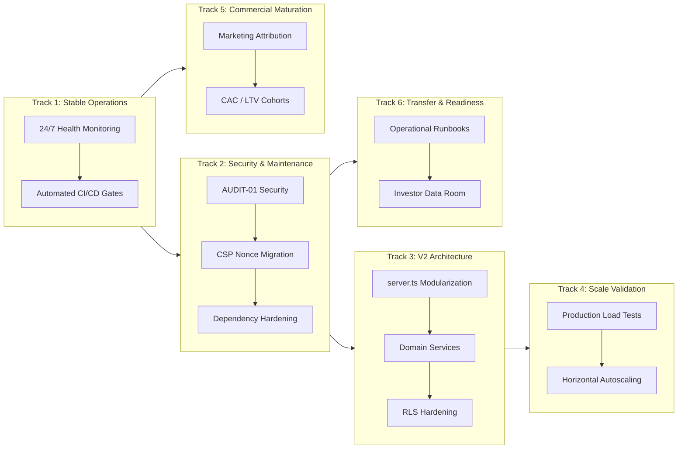

# POST-LAUNCH 20 — DELIVERABLE 7
# Strategic Roadmap 2.0 (Post-Launch Evolution)

- **Date:** 2026-09-22
- **Baseline Commit SHA:** `711d816b329dafbc8d05440029870174477b37a4`
- **Roadmap Scope:** Comprehensive Multi-Horizon Strategic Execution Plan
- **Preceding Milestone:** POST-LAUNCH 20 (Final Commercial Scale Report & Strategic Roadmap CLOSED)
- **POST-LAUNCH 21 (PL21) Status:** **NOT STARTED** (Execution strictly paused pending ChatGPT Web final authorization)

---

## 1. Executive Roadmap Architecture

Strategic Roadmap 2.0 structures engineering, operational, and commercial initiatives into six distinct, decoupled tracks. This prevents conflating day-to-day stability with high-scale architecture or commercial experimentation.

---

## 2. Six Strategic Execution Tracks

### Track 1: Current Stable Operations (Ongoing Baseline)
- **Objective:** Maintain reliable production uptime, transaction processing, and automated quality gates.
- **Key Deliverables:**
  - Continuous health polling on `/api/health` and `/api/admin/diagnostics`.
  - Zero-tolerance regression monitoring via GitHub Actions (`Selfcare Quality Gate`).
  - Automated database backup verification on Supabase PostgreSQL.
  - Active Stripe webhook idempotency and payment state synchronization.

---

### Track 2: Maintenance & Security Hardening (AUDIT-01 Immediate Priority)
- **Objective:** Systematically resolve identified security debt items without disrupting live traffic.
- **Key Deliverables:**
  - **SEC-006 CSP Nonce Migration:** Eliminate `unsafe-inline` from `script-src` by generating per-request cryptographic nonces in Vite and Express.
  - **Dependency Remediation:** Upgrade `multer` to resolve upstream multipart parsing advisory under controlled staging tests.
  - **Authentication Hardening:**
    - `SEC-008`: Implement active JWT revocation / token blocklist in Redis or database.
    - `SEC-009` & `SEC-010`: Enforce single-use password reset tokens and NIST-compliant password strength policies.
    - `SEC-011` & `SEC-012`: Reauthentication challenges before sensitive email or password changes.
  - **Data Exposure Hardening (`SEC-003`, `SEC-014`):** Replace remaining public `.select('*')` database queries with strict field DTO projections.

---

### Track 3: V2 Architecture & Modularization (AUDIT-03 Architecture)
- **Objective:** Transform the monolithic backend into an enterprise-grade, maintainable modular structure.
- **Key Deliverables:**
  - **`server.ts` Decomposition:** Extract routes into decoupled Express routers:
    - `/api/auth/*` -> `src/server/routes/auth.router.ts`
    - `/api/orders/*` & `/api/checkout/*` -> `src/server/routes/checkout.router.ts`
    - `/api/admin/*` -> `src/server/routes/admin.router.ts`
  - **Domain Service Layer:** Implement clean service controllers for catalog, inventory, payments, and notifications.
  - **Database Access Decoupling:** Introduce repository interfaces with fine-grained Supabase RLS policies, reducing reliance on `SUPABASE_SERVICE_ROLE_KEY`.

---

### Track 4: Future Scale & High-Concurrency Validation (AUDIT-02 Performance)
- **Objective:** Prepare infrastructure for high-traffic promotions and multi-user flash sales.
- **Key Deliverables:**
  - **High-Concurrency Load Testing:** Execute 50 to 250 VU stress tests using `scripts/load/pl20-scale.k6.js` against staging with simulated database writes.
  - **Performance Optimization (HOTFIX 20 Follow-up):** Close remaining ~115ms gap on PDP Largest Contentful Paint (LCP) to achieve the `<2500ms` core web vital target.
  - **Autoscaling Configuration:** Establish Railway horizontal container replica rules triggered by CPU (>75%) and memory (>80%) thresholds.

---

### Track 5: Commercial Measurement Maturation (AUDIT-05 CRO & Marketing)
- **Objective:** Move from low-volume transaction status to robust, statistically significant commercial cohorts.
- **Key Deliverables:**
  - **Attribution & Pixel Integration:** Connect live Meta Pixel, Google Analytics 4, and TikTok Pixel with server-side Conversion API (CAPI) deduplication.
  - **Commercial Cohort Analytics:** Automate CAC, LTV, churn rate, and repeat customer retention reporting in the admin BI dashboard.
  - **Conversion Rate Optimization (CRO):** Conduct A/B testing on checkout funnel friction and mobile product discovery.

---

### Track 6: Transfer Readiness & Institutional Governance (AUDIT-04 Legal & Operations)
- **Objective:** Provide turn-key documentation for potential operators, auditors, or institutional investors.
- **Key Deliverables:**
  - **Comprehensive Runbooks:** Create step-by-step incident management, credential rotation, and disaster recovery procedures.
  - **Legal & Regulatory Compliance:** Finalize PCI DSS 4.0.1 technical readiness checklist and GDPR/CCPA consumer data request workflows.
  - **Investor Data Room:** Package architecture diagrams, financial models, test evidence manifests, and code quality audits for executive due diligence.

---

## 3. Implementation Phasing & Sequencing

| Phase / Milestone | Primary Focus Tracks | Target Timeframe | Success Criteria |
| :--- | :---: | :---: | :--- |
| **Milestone 2.1 (Immediate)** | Track 1 & Track 2 | Weeks 1 - 2 | AUDIT-01 Security closed; SEC-006 resolved; multer patched |
| **Milestone 2.2 (Mid-Term)** | Track 3 & Track 5 | Weeks 3 - 6 | `server.ts` modularized; live marketing attribution active |
| **Milestone 2.3 (Long-Term)** | Track 4 & Track 6 | Weeks 7 - 10 | 100+ VU load certified; investor data room fully populated |
