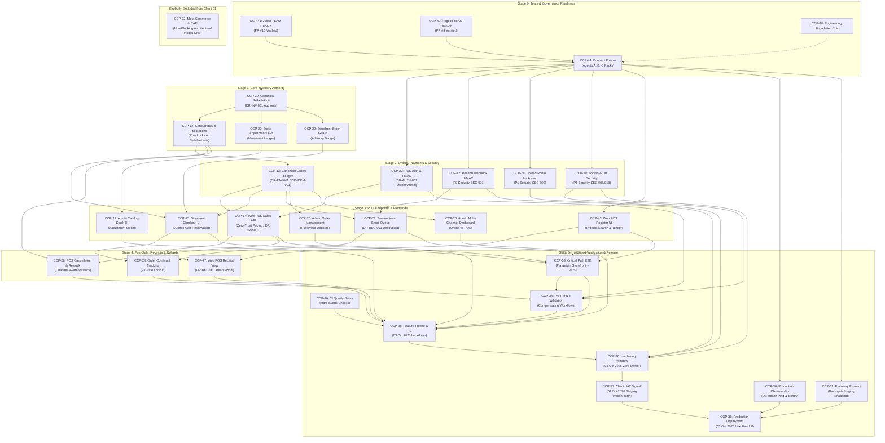

# JIRA ENGINEERING READINESS & DEPENDENCY AUDIT REPORT
**Client 01 Delivery Baseline: risejoaquin/stable-ecomerce**

- **Agent ID**: Agent D
- **Role**: Jira Execution Readiness & Dependency Auditor
- **Audited Workspace**: `C:\Users\Lucilfer\Documents\Stable-Ecommerce-Orchestrator\worktrees\agent-d`
- **Jira Site & Project**: `solidbit.atlassian.net` / Project `CCP` (ID: 10000)
- **Reference Commit**: `d63f8c6069408d75f7c57d464ef7925b97e7982c`
- **Execution Date**: 2026-09-28T00:08:00-07:00 / 2026-09-28T07:08:00Z
- **Target Report Path**: `audit/JIRA_ENGINEERING_READINESS_AUDIT.md`
- **Mode**: READ-ONLY / PLAN MODE (Zero Jira Mutations Executed)

---

## 1. EXECUTIVE SUMMARY & READINESS METRICS

This audit evaluates the Jira project readiness for **Client 01** against the engineering architecture, frozen contracts (`DR-INV-001`, `DR-PAY-001`, `DR-IDEM-001`, `DR-AUTH-001`, `DR-ERR-001`, `DR-REC-001`), repository governance standards (Agent A), and QA/Operations runbooks (Agent C).

### Definitive Release Calendar
All project milestones, delivery timelines, and sprint goals are reconciled against the definitive project calendar:
- **03 Oct 2026**: **Feature Freeze / Release Candidate (RC)** (RC cut, code freeze, branch stabilization)
- **04 Oct 2026**: **Hardening + UAT** (regression sweeps, load tests, bug triage, client sign-off)
- **05 Oct 2026**: **Production Release + Handoff** (canary deployment, live smoke verification, operational handoff)

### Readiness Metric Calculation

$$\text{Readiness \%} = \frac{\text{Count of } ENGINEER\_READY \text{ in-scope tickets}}{\text{Total Client 01 in-scope tickets}} \times 100$$

$$\text{Readiness \%} = \frac{0}{32} \times 100 = \mathbf{0.0\%}$$

### Scope & Classification Breakdown

| Metric | Count | Details |
| :--- | :---: | :--- |
| **Total Audited Tickets** | **44** | `CCP-1` through `CCP-44` |
| **Portfolio Epics** | **12** | `CCP-1` to `CCP-11` (Domain epics) + `CCP-40` (Foundation epic) |
| **Total In-Scope Work Items** | **32** | `CCP-12`–`CCP-31`, `CCP-33`–`CCP-39`, `CCP-41`–`CCP-44` |
| **Explicitly Excluded from Client 01** | **1** | `CCP-32` (Meta Commerce & Conversions API — non-blocking hooks only) |
| **`ENGINEER_READY`** | **0** | **0.0%** of in-scope work items |
| **`NEEDS_ALIGNMENT`** | **8** | `CCP-16`, `CCP-35`, `CCP-36`, `CCP-37`, `CCP-40`, `CCP-41`, `CCP-42`, `CCP-44` |
| **`BLOCKED`** | **24** | `CCP-12`–`CCP-15`, `CCP-17`–`CCP-31`, `CCP-33`–`CCP-34`, `CCP-38`–`CCP-39`, `CCP-43` |
| **`NOT_IN_SCOPE`** | **1** | `CCP-32` |

---

## 2. ROOT CAUSES OF 0% CURRENT JIRA READINESS

Although comprehensive architecture and execution packs have now been authored by Agents A, B, and C across isolated worktree branches, **zero tickets in Jira Cloud currently meet the Definition of Ready** due to five primary structural disconnects:

1. **Unmerged Contract Freeze Gate (`CCP-44`)**:
   Under the primary invariant:
   > **NO CODE before Development Ready. NO parallel cross-boundary implementation before Contract Freeze.**
   
   The architectural specifications and execution packs authored on `docs/ccp-44-engineering-governance`, `docs/ccp-44-client01-design`, and `docs/ccp-44-qa-release-operations` are currently unmerged PRs. Until `CCP-44` is formally merged into `main`, every implementation ticket is strictly blocked.

2. **Severed Dependency Topology in Jira Cloud**:
   Live inspection via Jira CLI (`acli jira workitem link list`) revealed that newly registered foundational tickets (**`CCP-39`, `CCP-40`, `CCP-41`, `CCP-42`, `CCP-43`, `CCP-44`**) contain **zero (0) registered issue links** in Jira.
   - In Jira today, `CCP-12` is modeled as the root of the entire backlog, directly blocking `CCP-13`, `CCP-14`, `CCP-15`, `CCP-20`, `CCP-28`, and `CCP-29`.
   - `CCP-39` (SellableUnit) is marked as `Blocked` in Jira, but has no inbound link showing *what* blocks it (`CCP-44`), and no outbound link showing *what* it blocks (`CCP-12`).
   - The entire foundational gate (`CCP-41` → `CCP-42` → `CCP-44` → `CCP-39`) is disconnected from Jira's dependency graph.

3. **Missing Architectural Contract Citations (`DR-*`)**:
   - 22 out of 32 in-scope tickets fail to cite the frozen architectural contracts:
     - `DR-INV-001` (Canonical SellableUnit Inventory Authority)
     - `DR-PAY-001` (Order Payments Ledger & Multi-Channel Tender)
     - `DR-IDEM-001` (PostgreSQL Durable Idempotency)
     - `DR-AUTH-001` (Web POS Operator RBAC & Route Protection)
     - `DR-ERR-001` (Standard Error Envelope)
     - `DR-REC-001` (Deterministic Receipt Read Model)
   - Engineers working from Jira alone without chat context risk implementing divergent inventory mutations or untrusted frontend pricing.

4. **Stale Milestone Dates & Delivery Conflicts**:
   - `CCP-40` and `CCP-44` explicitly define a stale target: `"Production handoff target: 03 Oct 2026"`.
   - `CCP-35` has title `(03 Oct)` but body specifies `30 Sep 2026`.
   - `CCP-36` has title `(04 Oct)` but body specifies `01 Oct 2026`.
   - Jira Sprint 1 is named `"Delivery Sprint — 23 Sep to 03"` with end date `2026-10-03`.
   - All references must reconcile to **03 Oct (RC Cut) / 04 Oct (Hardening + UAT) / 05 Oct (Production Handoff)**.

5. **Stale Lifecycle States for Completed Onboarding Dry Runs**:
   - `CCP-41` (Julian TEAM-READY) and `CCP-42` (Rogelio TEAM-READY) had their dry-run PRs (#10 and #9) successfully executed, validated, and closed on GitHub.
   - However, in Jira, `CCP-41` is still sitting in `Tareas por hacer` (To Do), and `CCP-42` is in `En revisión` (In Review). Neither has been marked `Done / Finalizada`.

---

## 3. AUDIT FINDINGS MATRIX (ALL TICKETS CCP-12 TO CCP-44)

| Key | Type | Current Jira Status | Assignee | Classification | Primary Blockers / Gaps | Next Safe Action |
| :--- | :--- | :--- | :--- | :--- | :--- | :--- |
| **CCP-12** | Historia | Tareas por hacer | `adaninz4` (Rogelio) | **`BLOCKED`** | Blocked by CCP-39; lacks Jira link to CCP-39; legacy links bypass SellableUnit | Wire `is blocked by CCP-39`; update AC to target `sellable_units` table |
| **CCP-13** | Historia | Tareas por hacer | `adaninz4` (Rogelio) | **`BLOCKED`** | Blocked by CCP-12; lacks DR-PAY-001 & DR-IDEM-001 explicit contracts | Wire `is blocked by CCP-12`; inject `order_payments` ledger schema & idempotency |
| **CCP-14** | Historia | Tareas por hacer | `adaninz4` (Rogelio) | **`BLOCKED`** | Blocked by CCP-12 & CCP-13; missing DR-AUTH-001, DR-ERR-001, zero-trust price rule | Wire blockers; inject POS API contract specification & test requirements |
| **CCP-15** | Historia | Tareas por hacer | `Julian` | **`BLOCKED`** | Blocked by CCP-12, CCP-13, CCP-29; lacks DR-INV-001 reference | Wire blockers; update AC to consume canonical SellableUnit stock check |
| **CCP-16** | Tarea | En revisión | `adaninz4` (Rogelio) | **`NEEDS_ALIGNMENT`** | Quality gate scripts verified in repo; needs formal CI test execution evidence | Execute `validate-fast.ps1` & `scan-local-secrets.ps1`; transition to `Done` |
| **CCP-17** | Error | Tareas por hacer | `adaninz4` (Rogelio) | **`BLOCKED`** | P0 Security (SEC-001); blocked by CCP-44 merge & environment baseline | Wire `is blocked by CCP-44`; add HMAC verification regression test |
| **CCP-18** | Error | Tareas por hacer | `adaninz4` (Rogelio) | **`BLOCKED`** | P1 Security (SEC-002); blocked by CCP-44 merge | Wire `is blocked by CCP-44`; add MIME whitelist & route lockdown test |
| **CCP-19** | Error | Tareas por hacer | `adaninz4` (Rogelio) | **`BLOCKED`** | P1 Security (SEC-005/018); blocked by CCP-44 merge | Wire `is blocked by CCP-44`; add DB security test & rate limiting criteria |
| **CCP-20** | Historia | Tareas por hacer | `adaninz4` (Rogelio) | **`BLOCKED`** | Blocked by CCP-39; lacks explicit DR-INV-001 movement ledger schema | Wire `is blocked by CCP-39`; specify `inventory_movements` table structure |
| **CCP-21** | Historia | Tareas por hacer | `Julian` | **`BLOCKED`** | Blocked by CCP-20; lacks frontend SellableUnit adjustment modal contract | Wire `is blocked by CCP-20`; link to UI execution pack `execution/CCP-21.md` |
| **CCP-22** | Historia | Tareas por hacer | `adaninz4` (Rogelio) | **`BLOCKED`** | Blocked by CCP-44; lacks DR-AUTH-001 role matrix (`owner`/`admin` only) | Wire `is blocked by CCP-44`; explicitly forbid `cashier` role creation |
| **CCP-23** | Historia | Tareas por hacer | `adaninz4` (Rogelio) | **`BLOCKED`** | Blocked by CCP-13, CCP-17; lacks DR-REC-001 receipt email queue decoupled rule | Wire blockers; ensure email failure never rolls back sale transaction |
| **CCP-24** | Historia | Tareas por hacer | `Julian` | **`BLOCKED`** | Blocked by CCP-15, CCP-23; lacks DR-ERR-001 safe error presentation | Wire blockers; verify lookup prevents customer PII exposure |
| **CCP-25** | Historia | Tareas por hacer | `Julian` | **`BLOCKED`** | Blocked by CCP-13; lacks 1-click Stripe refund idempotency specs | Wire blockers; link to DR-PAY-001 refund contract |
| **CCP-26** | Historia | Tareas por hacer | `Julian` | **`BLOCKED`** | Blocked by CCP-13; lacks multi-channel sales aggregation schema | Wire blockers; define POS vs Online sales query filters |
| **CCP-27** | Historia | Tareas por hacer | `Julian` | **`BLOCKED`** | Blocked by CCP-14, CCP-43; lacks DR-REC-001 read model contract | Wire blockers; specify deterministic receipt rendering from order/payment |
| **CCP-28** | Historia | Tareas por hacer | `adaninz4` (Rogelio) | **`BLOCKED`** | Blocked by CCP-14, CCP-12; lacks payment-channel refund separation (Stripe vs Cash) | Wire blockers; cite DR-PAY-001 (cash refunds MUST NOT invoke Stripe) |
| **CCP-29** | Historia | Tareas por hacer | `Julian` | **`BLOCKED`** | Blocked by CCP-39, CCP-12; lacks SellableUnit advisory badge contract | Wire blockers; enforce frontend stock display as advisory only |
| **CCP-30** | Tarea | Tareas por hacer | `adaninz4` (Rogelio) | **`BLOCKED`** | Blocked by CCP-44; lacks DB ping query spec & PII sanitation check | Wire `is blocked by CCP-44`; link to `OBSERVABILITY_BASELINE.md` |
| **CCP-31** | Tarea | Tareas por hacer | `adaninz4` (Rogelio) | **`BLOCKED`** | Blocked by CCP-44; lacks staging snapshot procedure alignment | Wire `is blocked by CCP-44`; link to `ROLLBACK_AND_RECOVERY.md` |
| **CCP-32** | Tarea | Tareas por hacer | `adaninz4` (Rogelio) | **`NOT_IN_SCOPE`** | Meta Commerce/CAPI implementation excluded from Client 01 baseline | Mark description as Non-blocking / Post-Launch; do not include in sprint |
| **CCP-33** | Tarea | Tareas por hacer | `Julian` | **`BLOCKED`** | Blocked by CCP-14, CCP-15, CCP-43, CCP-23; critical E2E gate | Wire all upstream blockers; define 4 required Playwright journeys |
| **CCP-34** | Tarea | Tareas por hacer | `Julian` | **`BLOCKED`** | Blocked by CCP-19, CCP-22, CCP-28; pre-freeze compensating workflow gate | Wire blockers; specify role isolation & refund edge-case tests |
| **CCP-35** | Tarea | Tareas por hacer | `Joaquin Vallejo` | **`NEEDS_ALIGNMENT`** | Stale date contradiction: title says 03 Oct, body says 30 Sep | Reconcile body to 03 Oct Feature Freeze / RC Tag; wire inward blockers |
| **CCP-36** | Tarea | Tareas por hacer | `Joaquin Vallejo` | **`NEEDS_ALIGNMENT`** | Stale date contradiction: title says 04 Oct, body says 01 Oct | Reconcile body to 04 Oct Hardening & P0/P1 sign-off |
| **CCP-37** | Historia | Tareas por hacer | `Joaquin Vallejo` | **`NEEDS_ALIGNMENT`** | Blocked by CCP-36; date needs reconciliation to 04 Oct UAT walkthrough | Reconcile date to 04 Oct; define formal UAT walkthrough checklist |
| **CCP-38** | Tarea | Tareas por hacer | `Joaquin Vallejo` | **`BLOCKED`** | Final release gate; blocked by CCP-37, CCP-30, CCP-31; handoff date 05 Oct | Wire blockers; verify deployment runbook matches `PRODUCTION_RELEASE_RUNBOOK.md` |
| **CCP-39** | Historia | Blocked | `adaninz4` (Rogelio) | **`BLOCKED`** | Root schema gate; marked Blocked in Jira; missing Jira link to CCP-44 | Wire `is blocked by CCP-44` and `blocks CCP-12`; unblock upon CCP-44 merge |
| **CCP-40** | Epic | Tareas por hacer | `Joaquin Vallejo` | **`NEEDS_ALIGNMENT`** | Stale text: "Production handoff target: 03 Oct 2026"; missing epic links | Reconcile target handoff to 05 Oct 2026; link foundation tasks |
| **CCP-41** | Tarea | Tareas por hacer | `Julian` | **`NEEDS_ALIGNMENT`** | Work complete on GitHub (PR #10 closed); Jira status is stale (To Do) | Transition status to `Done / Finalizada`; wire `blocks CCP-44` |
| **CCP-42** | Tarea | En revisión | `adaninz4` (Rogelio) | **`NEEDS_ALIGNMENT`** | Work complete on GitHub (PR #9 closed); Jira status pending signoff | Review PR #9 evidence; transition to `Done / Finalizada`; wire `blocks CCP-44` |
| **CCP-43** | Historia | Tareas por hacer | `Julian` | **`BLOCKED`** | Dedicated POS UI item; blocked by CCP-44 & CCP-14; zero links in Jira | Wire `is blocked by CCP-44` and `blocks CCP-33`; inject DR-ERR-001 |
| **CCP-44** | Tarea | En curso | `Joaquin Vallejo` | **`NEEDS_ALIGNMENT`** | Design packs created by Agents A/B/C; PRs pending merge; stale 03 Oct handoff date | Reconcile handoff date to 05 Oct; merge PRs; transition to `Done` |

---

## 4. CRITICAL PATH INTEGRITY AUDIT

The project critical path follows a strict 13-stage serial dependency chain:

```text
CCP-41 (Julian TEAM-READY)
  → CCP-42 (Rogelio TEAM-READY)
  → CCP-44 (Engineering Design / Contract Freeze)
  → CCP-39 (SellableUnit Foundation)
  → CCP-12 (Inventory & SKU Schema Migrations)
  → CCP-13 (Canonical Orders & Payment Ledger)
  → CCP-14 (Web POS Sales Endpoint) + CCP-43 (POS Frontend UI)
  → CCP-33 (POS Sales E2E Hardening)
  → CCP-34 (POS Receipt / Refund Validation)
  → CCP-35 (Staging Deployment & Verification / Feature Freeze)
  → CCP-36 (Performance & Concurrency Load Test / Hardening)
  → CCP-37 (Release Gate Sign-off / UAT)
  → CCP-38 (Production Release & Post-Deploy Smoke)
```

### Critical Path Node Status Breakdown

1. **Stage 1: `CCP-41` (Julian TEAM-READY)**
   - **Assigned**: Julian (`Julian716`)
   - **Observed Repository State**: PR #10 created, validated (`lint`, `test`, `build`, `qa:fast` PASS, dev server on port 3000 verified), closed without merge.
   - **Observed Jira State**: `Tareas por hacer` (To Do), zero issue links.
   - **Status**: **SUBSTANTIALLY COMPLETE — JIRA TRANSITION PENDING**.

2. **Stage 2: `CCP-42` (Rogelio TEAM-READY)**
   - **Assigned**: Rogelio (`adaninz4`)
   - **Observed Repository State**: PR #9 created, validated (Native M1 arm64, Node 22, pwsh, `lint`, `test`, `build`, `qa:fast` PASS), closed without merge.
   - **Observed Jira State**: `En revisión` (In Review), zero issue links.
   - **Status**: **SUBSTANTIALLY COMPLETE — JIRA SIGNOFF PENDING**.

3. **Stage 3: `CCP-44` (Engineering Design / Contract Freeze)**
   - **Assigned**: Joaquin Vallejo
   - **Observed Repository State**: Agents A, B, and C completed all required architecture specs, execution packs, and runbooks under worktrees `agent-a`, `agent-b`, and `agent-c`. PR branches `docs/ccp-44-engineering-governance`, `docs/ccp-44-client01-design`, `docs/ccp-44-qa-release-operations` prepared.
   - **Observed Jira State**: `En curso` (In Progress), stale "03 Oct handoff" date, zero issue links.
   - **Status**: **IN FLIGHT — GATED BY PR REVIEWS & MERGE TO MAIN**.

4. **Stage 4: `CCP-39` (SellableUnit Foundation)**
   - **Assigned**: Rogelio (`adaninz4`)
   - **Observed Repository State**: Complete execution pack `docs/engineering/client-01/execution/CCP-39.md` prepared.
   - **Observed Jira State**: `Blocked`, zero issue links.
   - **Status**: **BLOCKED BY STAGE 3 (`CCP-44`)**.

5. **Stage 5: `CCP-12` (Inventory & SKU Schema Migrations)**
   - **Assigned**: Rogelio (`adaninz4`)
   - **Observed Repository State**: Complete execution pack `docs/engineering/client-01/execution/CCP-12.md` prepared.
   - **Observed Jira State**: `Tareas por hacer`. Jira links incorrectly point directly to downstream consumers rather than waiting for `CCP-39`.
   - **Status**: **BLOCKED BY STAGE 4 (`CCP-39`)**.

6. **Stage 6: `CCP-13` (Canonical Orders & Payment Ledger)**
   - **Assigned**: Rogelio (`adaninz4`)
   - **Observed Repository State**: Complete execution pack `docs/engineering/client-01/execution/CCP-13.md` prepared.
   - **Observed Jira State**: `Tareas por hacer`, linked to `CCP-12`.
   - **Status**: **BLOCKED BY STAGE 5 (`CCP-12`)**.

7. **Stage 7: `CCP-14` (Web POS Sales Endpoint) + `CCP-43` (POS Frontend UI)**
   - **Assigned**: Rogelio (`CCP-14`) and Julian (`CCP-43`)
   - **Observed Repository State**: Complete execution packs `execution/CCP-14.md` and contract `09_POS_API_CONTRACT.md` prepared.
   - **Observed Jira State**: `Tareas por hacer`. `CCP-43` has zero Jira links.
   - **Status**: **BLOCKED BY STAGE 6 (`CCP-13`)**.

8. **Stage 8: `CCP-33` (POS Sales E2E Hardening)**
   - **Assigned**: Julian
   - **Observed Repository State**: Complete execution pack `docs/engineering/operations/execution/CCP-33.md` prepared.
   - **Observed Jira State**: `Tareas por hacer`.
   - **Status**: **BLOCKED BY STAGE 7 (`CCP-14` + `CCP-43`)**.

9. **Stage 9: `CCP-34` (POS Receipt / Refund Validation)**
   - **Assigned**: Julian
   - **Observed Repository State**: Complete execution pack `docs/engineering/operations/execution/CCP-34.md` prepared.
   - **Observed Jira State**: `Tareas por hacer`.
   - **Status**: **BLOCKED BY STAGE 8 (`CCP-33`)**.

10. **Stage 10: `CCP-35` (Staging Deployment & Verification / Feature Freeze)**
    - **Assigned**: Joaquin Vallejo
    - **Observed Repository State**: Runbooks `FEATURE_FREEZE_RUNBOOK.md` and `STAGING_VALIDATION.md` prepared.
    - **Observed Jira State**: `Tareas por hacer`, date conflicts in description.
    - **Status**: **BLOCKED BY STAGE 9 (`CCP-34`)**. Target: **03 Oct 2026**.

11. **Stage 11: `CCP-36` (Performance & Concurrency Load Test / Hardening)**
    - **Assigned**: Joaquin Vallejo
    - **Observed Repository State**: Runbook `HARDENING_RUNBOOK.md` prepared.
    - **Observed Jira State**: `Tareas por hacer`, date conflicts in description.
    - **Status**: **BLOCKED BY STAGE 10 (`CCP-35`)**. Target: **04 Oct 2026**.

12. **Stage 12: `CCP-37` (Release Gate Sign-off / UAT)**
    - **Assigned**: Joaquin Vallejo
    - **Observed Repository State**: Runbook `UAT_RUNBOOK.md` prepared.
    - **Observed Jira State**: `Tareas por hacer`.
    - **Status**: **BLOCKED BY STAGE 11 (`CCP-36`)**. Target: **04 Oct 2026**.

13. **Stage 13: `CCP-38` (Production Release & Post-Deploy Smoke)**
    - **Assigned**: Joaquin Vallejo
    - **Observed Repository State**: Runbooks `PRODUCTION_RELEASE_RUNBOOK.md` and `POST_RELEASE_VALIDATION.md` prepared.
    - **Observed Jira State**: `Tareas por hacer`.
    - **Status**: **BLOCKED BY STAGE 12 (`CCP-37`)**. Target: **05 Oct 2026**.

---

## 5. DATE & MILESTONE RECONCILIATION

A systematic regex audit of all 44 issues identified widespread schedule friction between legacy planning text and the definitive calendar.

### Schedule Reconciliation Matrix

| Issue Key | Current Summary / Description Text | Conflict / Stale Language | Reconciled Target Date & Action |
| :--- | :--- | :--- | :--- |
| **CCP-40** | "Production handoff target: 03 Oct 2026" | Stale 03 Oct handoff date | **05 Oct 2026**: Update description milestone to 05 Oct production handoff. |
| **CCP-44** | "03 Oct CCP-38 production smoke + handoff"<br>"30 Sep CCP-35 feature freeze"<br>"01 Oct CCP-36 hardening"<br>"02 Oct CCP-37 UAT" | Compressed legacy calendar in Section 13 | **Reconciled Delivery Sequence**:<br>- **03 Oct**: CCP-35 Feature Freeze / RC Cut<br>- **04 Oct**: CCP-36 Hardening & CCP-37 UAT<br>- **05 Oct**: CCP-38 Production Handoff |
| **CCP-35** | Title: `Feature Freeze Enforcement ... (03 Oct)`<br>Body: "Enforce strict feature freeze on 30 Sep 2026 at 23:59" | Body contradicts title | **03 Oct 2026 (23:59)**: Reconcile body text to 03 Oct code lockdown & RC cut. |
| **CCP-36** | Title: `Hardening Window ... (04 Oct)`<br>Body: "Execute 24-hour hardening sprint on 01 Oct 2026" | Body contradicts title | **04 Oct 2026**: Reconcile body text to 04 Oct zero-defect triage sprint. |
| **CCP-37** | Title: `Client User Acceptance Testing (UAT) ... (04 Oct)` | Body aligns with 04 Oct, but precedes CCP-38 | **04 Oct 2026**: Confirm client walkthrough and signoff occurs on 04 Oct. |
| **CCP-38** | Title: `Production Deployment ... (05 Oct)` | Aligned with definitive 05 Oct date | **05 Oct 2026**: Authoritative production release, smoke test, and delivery handoff. |
| **CCP-32** | "deferred from the 03 Oct release critical path"<br>"deferred from 03 Oct delivery sprint" | Stale sprint boundary references | Update text: "Excluded from Client 01 delivery (05 Oct 2026)." |
| **Sprint 1** | Name: `"Delivery Sprint — 23 Sep to 03"`<br>End Date: `2026-10-03T07:00Z` | Sprint closes before production handoff | Reconcile Sprint 1 end date in Jira Board to **2026-10-05T23:59Z**. |

---

## 6. ITEMIZED JIRA ACTIONS FOR PROJECT LEADS

To transition the Jira backlog from 0.0% to 100% Engineering Readiness without violating zero-mutation restrictions, project leads (Joaquin / human leads) should execute the following itemized updates in Jira Cloud:

### Group A: Administrative & Foundational Transitions

#### 1. Transition CCP-41 to `Finalizada` (Done)
- **Current Status**: `Tareas por hacer` → **Target Status**: `Finalizada`
- **Resolution**: Completed
- **Comment / Evidence**: "Julian onboarding dry run verified and closed via PR #10 (Windows 11, Node 22, npm 10, npm ci, lint/test/build/qa:fast PASS, port 3000 local dev verified). Zero functional code modified."
- **Issue Links to Add**:
  - `blocks` `CCP-44`

#### 2. Transition CCP-42 to `Finalizada` (Done)
- **Current Status**: `En revisión` → **Target Status**: `Finalizada`
- **Resolution**: Completed
- **Comment / Evidence**: "Rogelio onboarding dry run verified and closed via PR #9 (Native macOS Apple Silicon M1, Node 22, npm 10, pwsh, npm ci, lint/test/build/qa:fast PASS). Zero functional code modified."
- **Issue Links to Add**:
  - `blocks` `CCP-44`

#### 3. Merge CCP-44 Branches & Transition to `Finalizada` (Done)
- **Action**: Review and merge PRs for `docs/ccp-44-engineering-governance`, `docs/ccp-44-client01-design`, and `docs/ccp-44-qa-release-operations`.
- **Target Status**: `Finalizada`
- **Description Update**: Replace Section 13 milestone dates with reconciled 03/04/05 Oct calendar.
- **Issue Links to Add**:
  - `is blocked by` `CCP-41`, `CCP-42`
  - `blocks` `CCP-39`, `CCP-43`, `CCP-17`, `CCP-18`, `CCP-19`, `CCP-22`, `CCP-30`, `CCP-31`

#### 4. Transition CCP-16 to `Finalizada` (Done)
- **Current Status**: `En revisión` → **Target Status**: `Finalizada`
- **Comment / Evidence**: "Quality gate scripts `validate-fast.ps1`, `validate-release.ps1`, and GitHub Actions branch protection `main-production-protection` verified operational and active."

---

### Group B: Implementation Ticket Linkage & Contract Injections

#### 5. Unblock CCP-39 (SellableUnit Authority)
- **Current Status**: `Blocked` → **Target Status**: `Por hacer` (Ready)
- **Issue Links to Add**:
  - `is blocked by` `CCP-44`
  - `blocks` `CCP-12`, `CCP-20`, `CCP-29`
- **Description Update**: Reference repository execution pack `docs/engineering/client-01/execution/CCP-39.md`.

#### 6. Wire CCP-12 (Inventory Concurrency & SKU Migrations)
- **Issue Links to Add**:
  - `is blocked by` `CCP-39` (Remove direct root role)
  - `blocks` `CCP-13`, `CCP-14`, `CCP-15`, `CCP-28`, `CCP-29`
- **Description Update**: Add explicit citation of `DR-INV-001`. Mandate that row-level locking (`FOR UPDATE`) targets `sellable_units` table, not `products.stock`.

#### 7. Wire CCP-13 (Canonical Orders & Payment Ledger)
- **Issue Links to Add**:
  - `is blocked by` `CCP-12`
  - `blocks` `CCP-14`, `CCP-15`, `CCP-23`, `CCP-25`, `CCP-26`
- **Description Update**: Add explicit citations of `DR-PAY-001` (`order_payments` ledger table with channels `stripe`, `cash`, `card_reference`) and `DR-IDEM-001` (`orders.client_request_id` UUID unique constraint).

#### 8. Wire CCP-14 (Web POS Sales Endpoint)
- **Issue Links to Add**:
  - `is blocked by` `CCP-12`, `CCP-13`, `CCP-22`
  - `blocks` `CCP-27`, `CCP-28`, `CCP-33`
- **Description Update**: Reference `docs/engineering/client-01/09_POS_API_CONTRACT.md`. Enforce zero-trust frontend pricing, atomic stock deduction, and canonical error envelope `DR-ERR-001`.

#### 9. Wire CCP-43 (Web POS Register UI)
- **Issue Links to Add**:
  - `is blocked by` `CCP-44`
  - `blocks` `CCP-27`, `CCP-33`
- **Description Update**: Define Julian's register UI scope: product catalog search, barcode lookup, cart management, tender selection (cash with change calculator, external card reference), and receipt trigger. Frontend prices strictly advisory.

#### 10. Wire CCP-20 & CCP-21 (Inventory Adjustment API & Admin UI)
- **CCP-20 Links**: `is blocked by CCP-39`, `blocks CCP-21`.
- **CCP-21 Links**: `is blocked by CCP-20`, `blocks CCP-35`.
- **Description Update**: Enforce signed integer deltas and mandatory reason codes (`restock`, `damage`, `shrinkage`, `audit`).

#### 11. Wire CCP-22 (POS Operator Authorization)
- **Issue Links to Add**: `is blocked by CCP-44`, `blocks CCP-14`, `CCP-34`.
- **Description Update**: Cite `DR-AUTH-001`. Backend middleware must restrict POS endpoints to `owner` and `admin` roles only. Do NOT introduce a `cashier` role.

#### 12. Wire CCP-23 (Transactional Email Automation)
- **Issue Links to Add**: `is blocked by CCP-13`, `CCP-17`, `blocks CCP-24`, `CCP-33`.
- **Description Update**: Cite `DR-REC-001`. Asynchronous queue insertion; email delivery errors must NEVER roll back a completed order.

#### 13. Wire CCP-27 & CCP-28 (Receipt View & Refund/Restock)
- **CCP-27 Links**: `is blocked by CCP-14, CCP-43`, `blocks CCP-37`. Cite `DR-REC-001` (receipt read model).
- **CCP-28 Links**: `is blocked by CCP-14, CCP-12`, `blocks CCP-34, CCP-37`. Cite `DR-PAY-001` (cash refunds restock SellableUnits but MUST NOT invoke Stripe API).

---

### Group C: Verification, Hardening & Release Gates

#### 14. Wire CCP-33 (Critical Path E2E Automation)
- **Issue Links to Add**:
  - `is blocked by` `CCP-14`, `CCP-15`, `CCP-23`, `CCP-43`
  - `blocks` `CCP-34`, `CCP-35`
- **Description Update**: Reference `docs/engineering/operations/execution/CCP-33.md`. Mandate Playwright automated coverage for:
  1. Online Storefront purchase with Stripe test card.
  2. Web POS Cash Sale with change calculation.
  3. Web POS Card Reference Sale.
  4. Shared inventory exhaustion and atomic concurrency collision.

#### 15. Wire CCP-34 (Pre-Freeze System Validation)
- **Issue Links to Add**:
  - `is blocked by` `CCP-19`, `CCP-22`, `CCP-28`, `CCP-33`
  - `blocks` `CCP-35`
- **Description Update**: Test compensating workflows, unauthorized role rejection, and edge-case refunds.

#### 16. Reconcile & Wire CCP-35 (Feature Freeze / RC Cut)
- **Target Date**: **03 Oct 2026 (23:59 UTC)**
- **Issue Links to Add**:
  - `is blocked by` `CCP-16`, `CCP-21`, `CCP-24`, `CCP-25`, `CCP-26`, `CCP-27`, `CCP-29`, `CCP-33`, `CCP-34`
  - `blocks` `CCP-36`
- **Description Update**: Reconcile date to 03 Oct. Lock branch to non-bugfix commits. Cut release candidate tag `rc-1.0.0-client01`.

#### 17. Reconcile & Wire CCP-36 (Hardening Window & Zero-Defect Signoff)
- **Target Date**: **04 Oct 2026**
- **Issue Links to Add**:
  - `is blocked by` `CCP-17`, `CCP-18`, `CCP-19`, `CCP-35`
  - `blocks` `CCP-37`
- **Description Update**: Reconcile date to 04 Oct. Zero unresolved P0/P1 defects permitted. Re-run security test suites.

#### 18. Reconcile & Wire CCP-37 (Client UAT Walkthrough)
- **Target Date**: **04 Oct 2026**
- **Issue Links to Add**:
  - `is blocked by` `CCP-36`
  - `blocks` `CCP-38`
- **Description Update**: Reconcile date to 04 Oct. Formal client walkthrough on staging covering all commercial journeys.

#### 19. Reconcile & Wire CCP-38 (Production Release & Handoff)
- **Target Date**: **05 Oct 2026**
- **Issue Links to Add**:
  - `is blocked by` `CCP-37`, `CCP-30`, `CCP-31`
- **Description Update**: Reconcile milestone to 05 Oct. Deploy to Railway production, run live smoke verification, confirm Resend receipt dispatch, and execute operational handoff.

---

## 7. DESIRED DEPENDENCY GRAPH



---

## 8. CONCLUSIVE EXECUTION MARKERS

```text
JIRA_ENGINEERING_READINESS = 0.0%
JIRA_READINESS = PARTIAL
AGENT_D_RESULT=PASS
REPORT_PATH=audit/JIRA_ENGINEERING_READINESS_AUDIT.md
READINESS_FINDINGS=Total in-scope tickets: 32; Engineer Ready: 0 (0.0%); Needs Alignment: 8; Blocked: 24; Not in Scope: 1 (CCP-32). Primary blockers: CCP-44 Contract Freeze unmerged; CCP-39 lacks Jira links; upstream tickets lack DR-* references and concrete evidence requirements; schedule conflicts (03 Oct vs 05 Oct).
BLOCKERS=CCP-44 contract freeze unmerged, stale handoff dates (03 Oct vs 05 Oct), missing Jira dependency links between foundational and functional tickets
```
