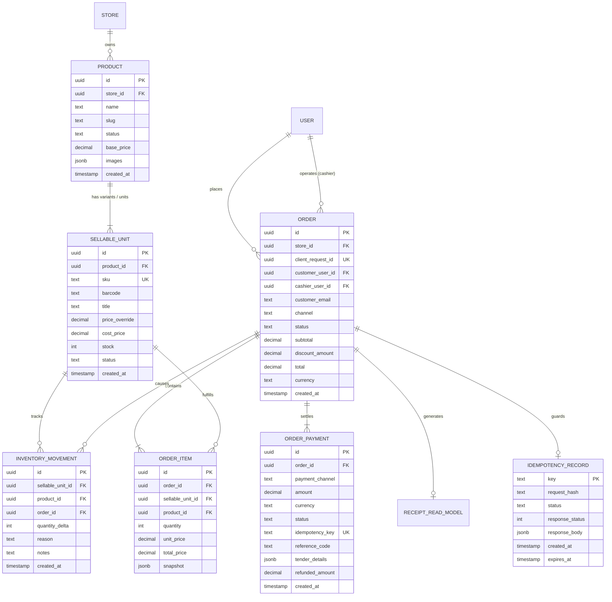
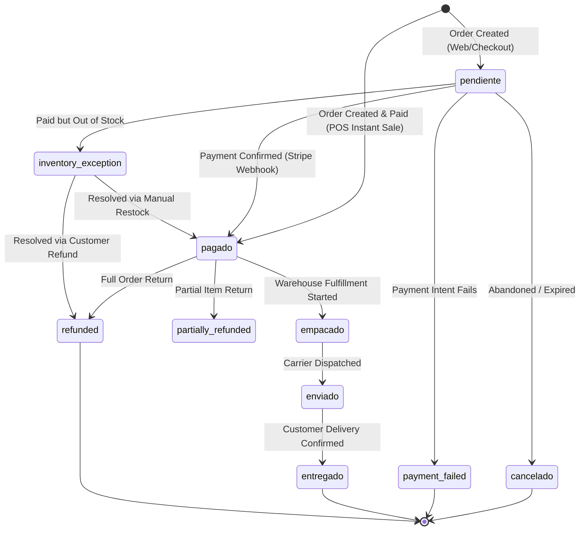
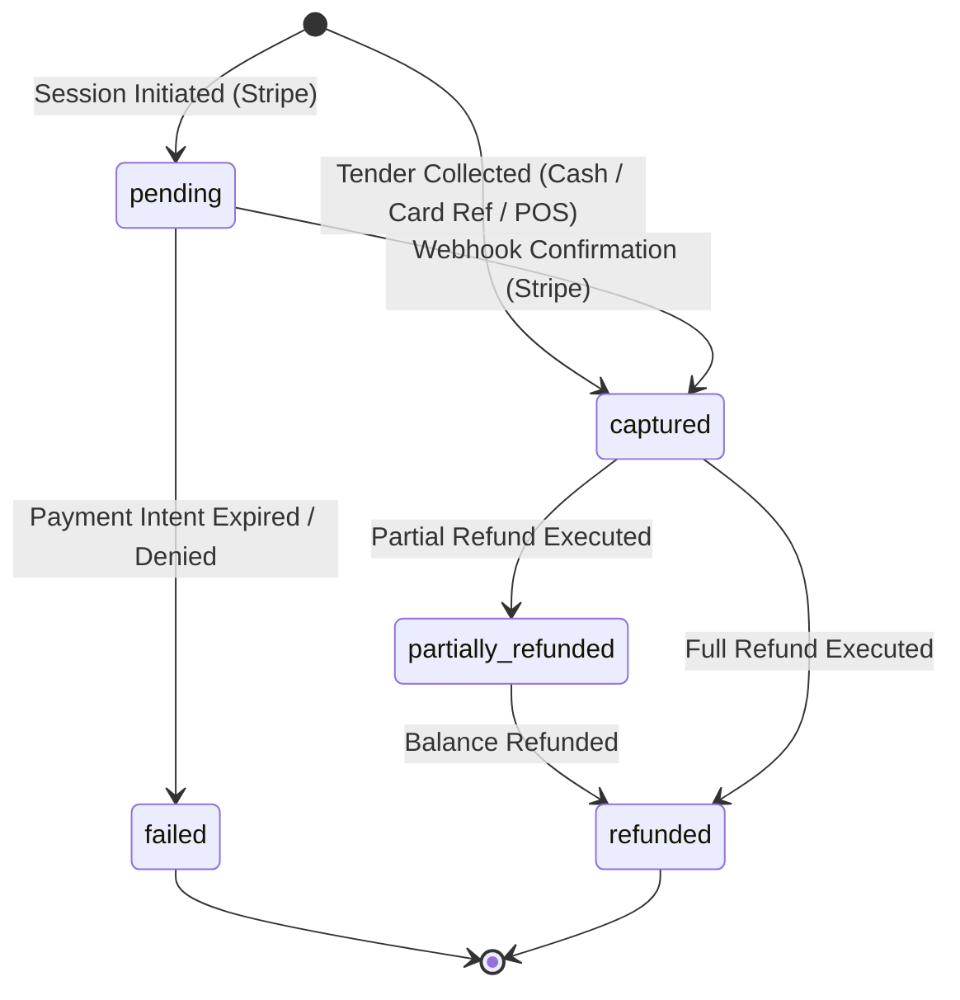
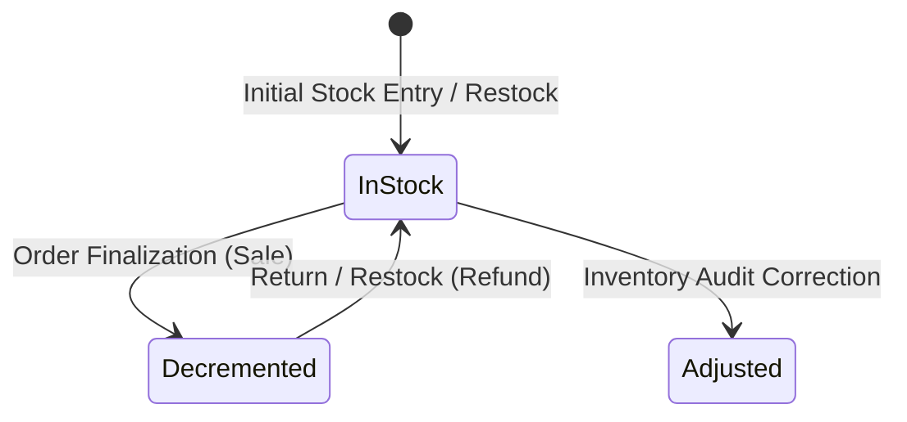

# Client 01 Domain Model & State Machines

## 1. Executive Summary

This document establishes the canonical domain model, entity relationships, and state machines for the Client 01 omnichannel commerce engine.

The domain model bridges catalog browsing, POS cashiering, inventory authority, and financial settlement into a cohesive, normalized transactional core.

---

## 2. Entity-Relationship Model



---

## 3. Core Domain Entities

### 3.1 Product vs. SellableUnit
The architectural separation between **Product** and **SellableUnit** is the foundation of DR-INV-001:

- **Product (Catalog Parent)**:
  - Conceptual container displayed in storefront collections and category pages.
  - Holds marketing descriptions, imagery, SEO metadata, tags, and category taxonomies.
  - Does **not** hold transactional stock authority.
- **SellableUnit (Transactional Inventory SKU)**:
  - The discrete, physical item that can be picked, packed, purchased, or returned.
  - Represents either a standalone non-variant item (1:1 with Product) or a specific SKU variant (e.g. `Color: Charcoal`, `Size: Large`).
  - Holds the immutable inventory count (`stock`), barcode scanner identifier, and optional price overrides.

### 3.2 Order & OrderItem
- **Order**:
  - The immutable commercial contract between the merchant and the purchaser.
  - Records the sales channel (`web_storefront` or `pos_register`), cashier user (if POS), and customer identity.
- **OrderItem**:
  - Snapshot of the item sold at the exact moment of sale.
  - Stores the historical `sellable_unit_id`, `product_id`, item title, variant attributes, and the settled unit price.

### 3.3 OrderPayment (DR-PAY-001 Ledger)
- Distinct transactional record of value transfer.
- Supports multi-channel tenders: `stripe`, `cash`, and `card_reference`.
- Maintains independent payment lifecycles and enables deterministic ledger reconciliation.

---

## 4. State Machines

### 4.1 Order Lifecycle State Machine



#### Order State Transitions & Permissible Actors
| Current State | Target State | Permissible Trigger | Actor / Service |
| :--- | :--- | :--- | :--- |
| `[None]` | `pendiente` | Checkout session created | Web Customer |
| `[None]` | `pagado` | Instant in-person sale tender settled | POS Cashier (`owner`/`admin`) |
| `pendiente` | `pagado` | `checkout.session.completed` verified | Stripe Webhook Service |
| `pendiente` | `payment_failed` | Payment authorization failed | Stripe Webhook Service |
| `pendiente` | `inventory_exception` | Payment succeeds but stock contention failed | Webhook / Finalize Order RPC |
| `pendiente` | `cancelado` | Session timeout or manual abandonment | System Worker / Customer |
| `pagado` | `empacado` | Fulfillment packaging started | Admin Staff (`owner`/`admin`) |
| `empacado` | `enviado` | Tracking number attached, dispatched | Admin Staff (`owner`/`admin`) |
| `enviado` | `entregado` | Carrier delivery confirmed | Carrier Webhook / Admin Staff |
| `pagado` | `refunded` | Full refund processed and items returned | Admin Staff / POS Operator |
| `pagado` | `partially_refunded` | Subset of items returned | Admin Staff / POS Operator |

---

### 4.2 Payment Ledger State Machine (DR-PAY-001)



#### Invariant Rules:
1. An order can transition to `pagado` if and only if the sum of all `captured` records in `order_payments` equals or exceeds `orders.total`.
2. A payment record in `captured` status can never transition back to `pending`.
3. Cash and Card Reference payments are recorded directly in `captured` state upon POS transaction execution.

---

### 4.3 Inventory Movement Lifecycle



#### Movement Reason Taxonomy:
- `sale`: Atomic deduction upon verified sale (`quantity_delta < 0`).
- `refund`: Restocking of returned physical unit (`quantity_delta > 0`).
- `restock`: Replenishment from supplier/warehouse purchase order (`quantity_delta > 0`).
- `manual_adjustment`: Audit count adjustment (`quantity_delta <> 0`).
- `correction`: Data correction or reconciliation patch (`quantity_delta <> 0`).

---

## 5. TypeScript Domain Types

```typescript
export type SalesChannel = 'web_storefront' | 'pos_register';

export type OrderStatus =
  | 'pendiente'
  | 'pagado'
  | 'payment_failed'
  | 'inventory_exception'
  | 'empacado'
  | 'enviado'
  | 'entregado'
  | 'cancelado'
  | 'refunded'
  | 'partially_refunded';

export type PaymentChannel = 'stripe' | 'cash' | 'card_reference';

export type PaymentStatus =
  | 'pending'
  | 'captured'
  | 'failed'
  | 'partially_refunded'
  | 'refunded';

export interface DomainProduct {
  id: string;
  storeId: string;
  name: string;
  slug: string;
  description?: string;
  basePrice: number;
  status: 'draft' | 'active' | 'archived' | 'out_of_stock';
  images: string[];
  category?: string;
  createdAt: string;
  updatedAt: string;
}

export interface DomainSellableUnit {
  id: string;
  productId: string;
  sku: string;
  barcode?: string;
  title: string;
  priceOverride?: number;
  costPrice?: number;
  stock: number;
  status: 'active' | 'archived' | 'discontinued';
  createdAt: string;
  updatedAt: string;
}

export interface DomainOrder {
  id: string;
  storeId: string;
  clientRequestId?: string;
  customerUserId?: string;
  cashierUserId?: string;
  customerEmail?: string;
  channel: SalesChannel;
  status: OrderStatus;
  subtotal: number;
  discountAmount: number;
  total: number;
  currency: 'mxn';
  posTerminalId?: string;
  notes?: string;
  paidAt?: string;
  cancelledAt?: string;
  refundedAt?: string;
  createdAt: string;
  updatedAt: string;
}

export interface DomainOrderItem {
  id: string;
  orderId: string;
  sellableUnitId: string;
  productId: string;
  quantity: number;
  unitPrice: number;
  totalPrice: number;
  snapshot: {
    productName: string;
    unitTitle: string;
    sku: string;
    barcode?: string;
    attributes?: Record<string, string>;
  };
}

export interface DomainOrderPayment {
  id: string;
  orderId: string;
  paymentChannel: PaymentChannel;
  amount: number;
  currency: 'mxn';
  status: PaymentStatus;
  idempotencyKey: string;
  referenceCode?: string;
  tenderDetails?: {
    amountTendered?: number;
    changeGiven?: number;
    authCode?: string;
    terminalId?: string;
    notes?: string;
  };
  refundedAmount: number;
  createdAt: string;
  updatedAt: string;
}
```
