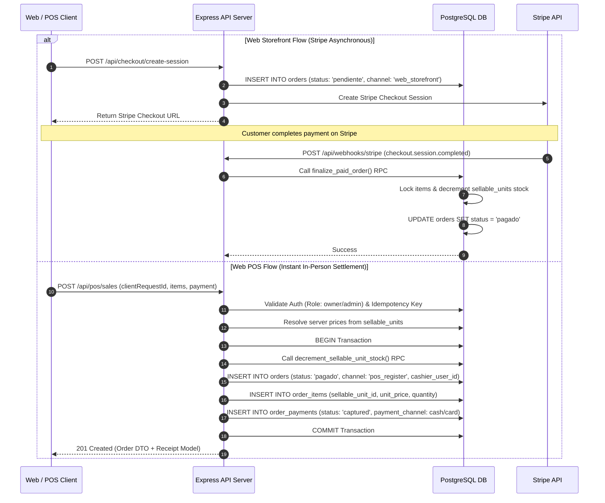

# Canonical Order Contract & Omnichannel Schema

## 1. Executive Summary

This document defines the canonical order model for the Client 01 platform.

The order is the authoritative commercial contract representing a customer purchase across all channels (`web_storefront` and `pos_register`). It records immutable financial values, channel origin, cashier metadata, and line items linked directly to `sellable_units`.

---

## 2. Omnichannel Schema Enhancements (DDL)

```sql
-- Migration: Enhance Orders and Order Items for Omnichannel and POS Support

-- 1. Create channel ENUM or CHECK constraint
DO $$ BEGIN
  CREATE TYPE sales_channel AS ENUM ('web_storefront', 'pos_register');
EXCEPTION
  WHEN duplicate_object THEN null;
END $$;

-- 2. Alter orders table
ALTER TABLE orders
  ADD COLUMN IF NOT EXISTS client_request_id UUID UNIQUE,
  ADD COLUMN IF NOT EXISTS channel TEXT NOT NULL DEFAULT 'web_storefront' CHECK (channel IN ('web_storefront', 'pos_register')),
  ADD COLUMN IF NOT EXISTS cashier_user_id UUID REFERENCES users(id) ON DELETE SET NULL,
  ADD COLUMN IF NOT EXISTS pos_terminal_id TEXT,
  ADD COLUMN IF NOT EXISTS receipt_number TEXT UNIQUE;

CREATE INDEX IF NOT EXISTS idx_orders_client_request_id ON orders(client_request_id) WHERE client_request_id IS NOT NULL;
CREATE INDEX IF NOT EXISTS idx_orders_channel ON orders(channel);
CREATE INDEX IF NOT EXISTS idx_orders_cashier_user_id ON orders(cashier_user_id) WHERE cashier_user_id IS NOT NULL;
CREATE INDEX IF NOT EXISTS idx_orders_receipt_number ON orders(receipt_number) WHERE receipt_number IS NOT NULL;

-- 3. Alter order_items table to bind to sellable_units
ALTER TABLE order_items
  ADD COLUMN IF NOT EXISTS sellable_unit_id UUID REFERENCES sellable_units(id) ON DELETE RESTRICT,
  ADD COLUMN IF NOT EXISTS sku TEXT,
  ADD COLUMN IF NOT EXISTS total_price DECIMAL(10,2) CHECK (total_price >= 0),
  ADD COLUMN IF NOT EXISTS tax_amount DECIMAL(10,2) DEFAULT 0 CHECK (tax_amount >= 0),
  ADD COLUMN IF NOT EXISTS discount_amount DECIMAL(10,2) DEFAULT 0 CHECK (discount_amount >= 0);

CREATE INDEX IF NOT EXISTS idx_order_items_sellable_unit_id ON order_items(sellable_unit_id);
```

---

## 3. Order Data Structure & Constraints

### 3.1 Field Invariants
1. **`client_request_id`**: Mandatory for POS transactions (`channel = 'pos_register'`). Optional for web orders. Enforces durable deduplication.
2. **`channel`**: Must be explicitly set to `'pos_register'` for POS operations and `'web_storefront'` for online checkout sessions.
3. **`cashier_user_id`**: Mandatory when `channel = 'pos_register'`. Must reference an authenticated user with role `owner` or `admin`.
4. **`total` Invariant**: `orders.total` must strictly equal `orders.subtotal - orders.discount_amount + orders.shipping_cost + orders.tax_amount`.
5. **Item Financial Summation**: `orders.subtotal` must strictly equal the sum of all associated `order_items.total_price`.

### 3.2 OrderItem Snapshot Contract
To protect historical integrity against future product catalog or pricing edits, each line item must store a complete JSON snapshot:

```json
{
  "productName": "Revitalizing Night Serum",
  "unitTitle": "50ml Glass Bottle",
  "sku": "SKU-SERUM-50ML",
  "barcode": "7501234567890",
  "attributes": {
    "size": "50ml",
    "formulation": "Standard"
  },
  "originalPrice": 450.00,
  "settledPrice": 450.00
}
```

---

## 4. Order Creation Flow Comparison



---

## 5. Order Transition State Rules

```
┌─────────────────────┬───────────────────────────┬───────────────────────────────────────────┐
│ From State          │ To State                  │ Permissible Conditions                    │
├─────────────────────┼───────────────────────────┼───────────────────────────────────────────┤
│ [Init]              │ pendiente                 │ Online checkout initiated                 │
│ [Init]              │ pagado                    │ In-store POS sale settled successfully    │
│ pendiente           │ pagado                    │ Valid Stripe webhook confirmation         │
│ pendiente           │ payment_failed            │ Webhook reports payment failed/expired    │
│ pendiente           │ inventory_exception       │ Payment succeeded but stock decrements fail│
│ pendiente           │ cancelado                 │ Checkout abandoned or manually canceled   │
│ pagado              │ empacado                  │ Staff begins order fulfillment            │
│ empacado            │ enviado                   │ Carrier tracking attached                 │
│ enviado             │ entregado                 │ Delivery confirmed                        │
│ pagado / entregado  │ partially_refunded        │ Subset of items returned and refunded     │
│ pagado / entregado  │ refunded                  │ All items returned and fully refunded     │
└─────────────────────┴───────────────────────────┴───────────────────────────────────────────┘
```

---

## 6. TypeScript Interface Definition

```typescript
export interface OrderItemInput {
  sellableUnitId: string;
  quantity: number;
}

export interface OrderItemRecord {
  id: string;
  orderId: string;
  sellableUnitId: string;
  productId: string;
  sku: string;
  quantity: number;
  unitPrice: number;
  totalPrice: number;
  taxAmount: number;
  discountAmount: number;
  snapshot: {
    productName: string;
    unitTitle: string;
    sku: string;
    barcode?: string;
    attributes?: Record<string, string>;
    originalPrice: number;
    settledPrice: number;
  };
}

export interface OrderRecord {
  id: string;
  storeId: string;
  clientRequestId?: string;
  channel: 'web_storefront' | 'pos_register';
  status:
    | 'pendiente'
    | 'pagado'
    | 'payment_failed'
    | 'inventory_exception'
    | 'empacado'
    | 'enviado'
    | 'entregado'
    | 'cancelado'
    | 'refunded'
    | 'partially_refunded';
  customerUserId?: string;
  cashierUserId?: string;
  customerEmail?: string;
  subtotal: number;
  discountAmount: number;
  total: number;
  currency: 'mxn';
  posTerminalId?: string;
  receiptNumber?: string;
  notes?: string;
  paidAt?: string;
  cancelledAt?: string;
  refundedAt?: string;
  createdAt: string;
  updatedAt: string;
  items?: OrderItemRecord[];
}
```
