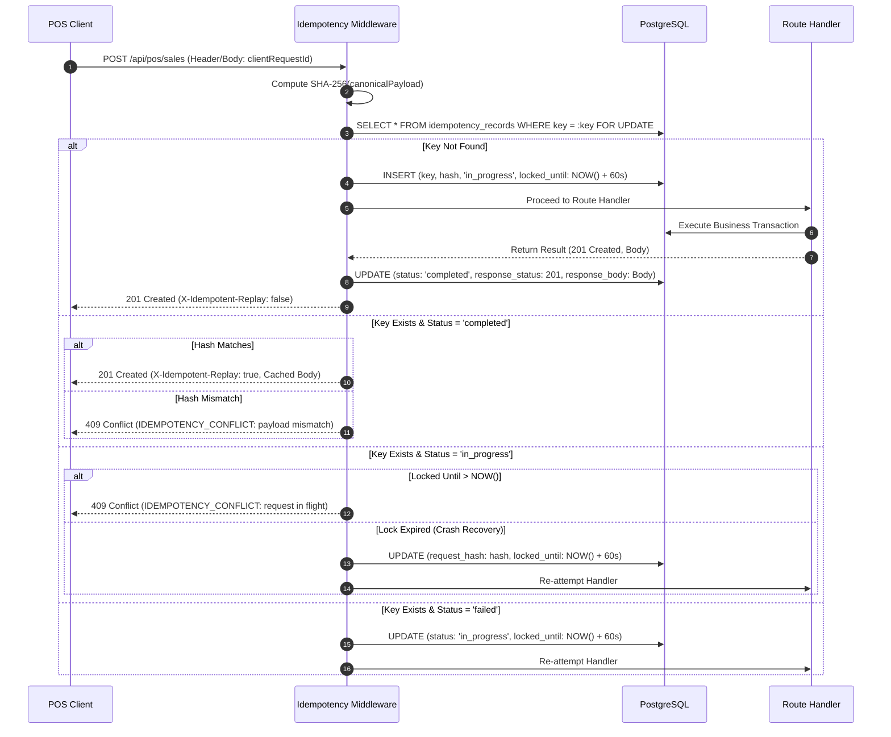

# Durable Idempotency Contract & Engine (DR-IDEM-001)

## 1. Architectural Contract Specification

| Contract Identifier | Classification | Scope | Authoritative Source |
| :--- | :--- | :--- | :--- |
| **DR-IDEM-001** | **FROZEN CONTRACT** | Backend Middleware & POS APIs | Repository Architecture Freeze |

### Invariant Rules:
1. **Durable Persistence**: Idempotency is backed by PostgreSQL storage (`idempotency_records`). In-memory caches (e.g. Map, LRU) or transient Redis instances are strictly prohibited as primary idempotency authorities.
2. **Client Request Identifier**:
   - Every mutation request to the POS API (`POST /api/pos/sales`, `POST /api/pos/orders/:id/refund`) must provide a unique UUIDv4 via the `clientRequestId` body property or the `Idempotency-Key` HTTP header.
   - POS requests omitting `clientRequestId` must be rejected with HTTP `400 VALIDATION_ERROR`.
3. **Payload Semantic Matching**:
   - When a known key is presented, the server computes a deterministic SHA-256 hash of the normalized request payload and compares it against the persisted hash.
   - **Matching Key + Matching Payload**: The server returns the previously persisted HTTP status code and response body with the HTTP response header `X-Idempotent-Replay: true`. No mutations are re-executed.
   - **Matching Key + Mismatched Payload**: The server immediately terminates execution and returns HTTP `409 IDEMPOTENCY_CONFLICT`.
4. **In-Flight Lock Protection**:
   - A key in an `in_progress` state locks concurrent parallel requests using the same key. Concurrent callers receive HTTP `409 IDEMPOTENCY_CONFLICT` or await release (timeout 10s).
   - If an unhandled exception or crash occurs, in-progress locks expire automatically after 60 seconds (`expires_at`).
5. **Stripe Webhook Compatibility**: Existing Stripe webhook event idempotency (in `stripe_events`) remains active and independent.

---

## 2. Database Schema DDL

```sql
-- Migration: Create Idempotency Engine Table

CREATE TABLE IF NOT EXISTS idempotency_records (
  key TEXT PRIMARY KEY,
  request_hash TEXT NOT NULL,
  endpoint TEXT NOT NULL,
  status TEXT NOT NULL DEFAULT 'in_progress' CHECK (status IN ('in_progress', 'completed', 'failed')),
  response_status INT,
  response_headers JSONB DEFAULT '{}'::jsonb,
  response_body JSONB,
  error_message TEXT,
  created_at TIMESTAMP WITH TIME ZONE DEFAULT NOW(),
  expires_at TIMESTAMP WITH TIME ZONE DEFAULT (NOW() + INTERVAL '24 hours'),
  locked_until TIMESTAMP WITH TIME ZONE DEFAULT (NOW() + INTERVAL '60 seconds')
);

CREATE INDEX IF NOT EXISTS idx_idempotency_expires_at ON idempotency_records(expires_at);
CREATE INDEX IF NOT EXISTS idx_idempotency_status_locked ON idempotency_records(status, locked_until);

-- Function to prune expired records (scheduled or periodic)
CREATE OR REPLACE FUNCTION purge_expired_idempotency_records()
RETURNS INT AS $$
DECLARE
  deleted_count INT;
BEGIN
  DELETE FROM idempotency_records
  WHERE expires_at < NOW();
  GET DIAGNOSTICS deleted_count = ROW_COUNT;
  RETURN deleted_count;
END;
$$ LANGUAGE plpgsql;
```

---

## 3. Idempotency State & Execution Flow



---

## 4. Canonical Payload Normalization Algorithm

To ensure stable hashing regardless of key ordering in JSON objects, payloads are serialized using deterministic key sorting:

```typescript
import { createHash } from 'crypto';

export function canonicalizeJson(obj: unknown): string {
  if (obj === null || typeof obj !== 'object') {
    return JSON.stringify(obj);
  }

  if (Array.isArray(obj)) {
    return '[' + obj.map(canonicalizeJson).join(',') + ']';
  }

  const sortedKeys = Object.keys(obj as Record<string, unknown>).sort();
  const entries = sortedKeys.map(
    (key) => `${JSON.stringify(key)}:${canonicalizeJson((obj as Record<string, unknown>)[key])}`
  );
  return '{' + entries.join(',') + '}';
}

export function computeRequestHash(endpoint: string, payload: unknown): string {
  const normalized = `${endpoint}::${canonicalizeJson(payload)}`;
  return createHash('sha256').update(normalized, 'utf8').digest('hex');
}
```

---

## 5. Middleware Interface Contract

```typescript
export interface IdempotencyRecord {
  key: string;
  requestHash: string;
  endpoint: string;
  status: 'in_progress' | 'completed' | 'failed';
  responseStatus: number | null;
  responseHeaders: Record<string, string>;
  responseBody: unknown | null;
  errorMessage: string | null;
  createdAt: string;
  expiresAt: string;
  lockedUntil: string;
}

export interface IdempotencyOptions {
  ttlHours?: number;
  lockTimeoutSeconds?: number;
  keyHeaderName?: string;
  keyBodyPath?: string;
}
```
