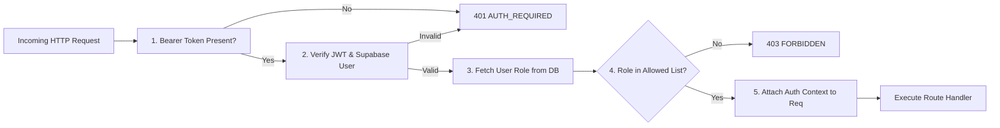

# Backend Authorization & Role Contract (DR-AUTH-001)

## 1. Architectural Contract Specification

| Contract Identifier | Classification | Scope | Authoritative Source |
| :--- | :--- | :--- | :--- |
| **DR-AUTH-001** | **FROZEN CONTRACT** | Backend Middleware & API Guards | Repository Architecture Freeze |

### Invariant Rules:
1. **Permitted POS Operators**: Access to Web POS operational endpoints is strictly granted to users holding the role of `'owner'` or `'admin'`.
2. **Explicit Denials**: Users holding the role `'user'` (regular ecommerce customers) or `'support'` (read-only support agents) are denied access with HTTP `403 FORBIDDEN`. Unauthenticated callers receive HTTP `401 AUTH_REQUIRED`.
3. **No New Cashier Role**: To minimize surface area and eliminate migration friction during Client 01, **no new "cashier" role** is introduced. Cash register staff must be provisioned with an `admin` or `owner` account.
4. **Backend-Enforced Authority**: Frontend route guards or UI hiding are strictly cosmetic. Every backend endpoint must independently authenticate the session and authorize the role before executing business logic.
5. **Least Privilege Boundary**: Authorization to operate the POS terminal (`/api/pos/*`) does not automatically grant unrestricted access to store settings, Stripe account keys, or user role management (`/api/admin/users/*`).

---

## 2. Endpoint Authorization Matrix

```
┌─────────────────────────────────┬────────┬────────┬─────────┬─────────┬──────────────────────┐
│ Route / Endpoint                │ Anon   │ User   │ Support │ Admin   │ Owner                │
├─────────────────────────────────┼────────┼────────┼─────────┼─────────┼──────────────────────┤
│ GET  /api/products              │ ALLOW  │ ALLOW  │ ALLOW   │ ALLOW   │ ALLOW (Public)       │
│ GET  /api/pos/catalog/search    │ DENY   │ DENY   │ DENY    │ ALLOW   │ ALLOW (POS Search)   │
│ GET  /api/pos/units/:id         │ DENY   │ DENY   │ DENY    │ ALLOW   │ ALLOW (Unit Detail)  │
│ POST /api/pos/sales             │ DENY   │ DENY   │ DENY    │ ALLOW   │ ALLOW (Create Sale)  │
│ GET  /api/pos/orders/:id/receipt│ DENY   │ DENY   │ DENY    │ ALLOW   │ ALLOW (View Receipt) │
│ POST /api/pos/orders/:id/refund │ DENY   │ DENY   │ DENY    │ ALLOW   │ ALLOW (POS Refund)   │
│ POST /api/pos/orders/:id/email  │ DENY   │ DENY   │ DENY    │ ALLOW   │ ALLOW (Send Receipt) │
│ GET  /api/admin/sellable-units  │ DENY   │ DENY   │ DENY    │ ALLOW   │ ALLOW (Inventory UI) │
│ POST /api/admin/sellable-units  │ DENY   │ DENY   │ DENY    │ ALLOW   │ ALLOW (Create SKU)   │
│ PATCH/api/admin/sellable-units  │ DENY   │ DENY   │ DENY    │ ALLOW   │ ALLOW (Update Stock) │
│ GET  /api/admin/orders          │ DENY   │ DENY   │ ALLOW   │ ALLOW   │ ALLOW (Order Audit)  │
│ GET  /api/admin/payments        │ DENY   │ DENY   │ DENY    │ ALLOW   │ ALLOW (Ledger Audit) │
│ POST /api/admin/stores/config   │ DENY   │ DENY   │ DENY    │ DENY    │ ALLOW (Owner Only)   │
│ POST /api/admin/users/roles     │ DENY   │ DENY   │ DENY    │ DENY    │ ALLOW (Owner Only)   │
└─────────────────────────────────┴────────┴────────┴─────────┴─────────┴──────────────────────┘
```

---

## 3. Middleware Implementation Architecture

### 3.1 Authentication & Role Extraction Pipeline
Every authenticated request undergoes three progressive inspection gates:



### 3.2 Express Middleware Implementation Design

```typescript
import { Request, Response, NextFunction } from 'express';
import { supabaseAdmin } from '../lib/supabase';
import { AppError } from '../errors/AppError';

export interface AuthenticatedUser {
  id: string;
  email: string;
  role: 'owner' | 'admin' | 'support' | 'user';
  fullName?: string;
}

declare global {
  namespace Express {
    interface Request {
      user?: AuthenticatedUser;
    }
  }
}

export const authenticateToken = async (req: Request, res: Response, next: NextFunction) => {
  const authHeader = req.headers.authorization;
  if (!authHeader || !authHeader.startsWith('Bearer ')) {
    return next(new AppError('AUTH_REQUIRED', 'Authentication credentials missing or malformed', 401));
  }

  const token = authHeader.split(' ')[1];

  try {
    const { data: authData, error: authError } = await supabaseAdmin.auth.getUser(token);
    if (authError || !authData.user) {
      return next(new AppError('AUTH_REQUIRED', 'Invalid or expired session token', 401));
    }

    // Fetch authoritative application role from users table
    const { data: userProfile, error: profileError } = await supabaseAdmin
      .from('users')
      .select('id, email, role, full_name')
      .eq('id', authData.user.id)
      .single();

    if (profileError || !userProfile) {
      return next(new AppError('FORBIDDEN', 'User profile not found or inactive', 403));
    }

    req.user = {
      id: userProfile.id,
      email: userProfile.email,
      role: userProfile.role,
      fullName: userProfile.full_name
    };

    next();
  } catch (err) {
    return next(new AppError('INTERNAL_ERROR', 'Failed to authenticate user', 500, { originalError: String(err) }));
  }
};

export const requireRoles = (allowedRoles: Array<'owner' | 'admin' | 'support' | 'user'>) => {
  return (req: Request, res: Response, next: NextFunction) => {
    if (!req.user) {
      return next(new AppError('AUTH_REQUIRED', 'Authentication required', 401));
    }

    if (!allowedRoles.includes(req.user.role)) {
      return next(
        new AppError('FORBIDDEN', `Role '${req.user.role}' is not authorized to perform this operation`, 403, {
          requiredRoles: allowedRoles,
          currentRole: req.user.role
        })
      );
    }

    next();
  };
};

// Specialized convenience guard for Web POS endpoints
export const requirePosOperator = [
  authenticateToken,
  requireRoles(['owner', 'admin'])
];
```

---

## 4. Security Audit Logging

All POS actions executed by authenticated staff members must write an immutable entry to `audit_logs`:

```typescript
export async function logAuditEvent(params: {
  actorUserId: string;
  action: string;
  entityType: 'order' | 'sellable_unit' | 'payment';
  entityId: string;
  metadata?: Record<string, unknown>;
}) {
  await supabaseAdmin.from('audit_logs').insert({
    actor_user_id: params.actorUserId,
    action: params.action,
    entity_type: params.entityType,
    entity_id: params.entityId,
    metadata: params.metadata || {},
    created_at: new Date().toISOString()
  });
}
```
