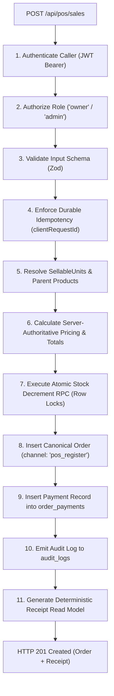

# Web POS API Contract & OpenAPI Specification

## 1. Executive Summary

This document specifies the REST interface contracts for the Web Point of Sale (POS) system.

The primary endpoint is `POST /api/pos/sales`, which executes an in-person retail transaction atomically, backed by server-side price resolution, atomic stock decrements, and canonical payment ledger insertion.

---

## 2. Behavioral Sequence & Server Responsibilities

The server enforces an unbypassable 11-step execution sequence for every incoming sale:



### Invariant: Zero-Trust Frontend Pricing
The client application submits only `sellableUnitId` and `quantity`. If the client submits `price`, `subtotal`, or `total` fields, they are **strictly ignored by the server**. The server resolves prices directly from the database (`sellable_units.price_override` or `products.price`).

---

## 3. OpenAPI 3.1 Specification

### 3.1 `POST /api/pos/sales`
Creates a completed in-store POS sale transaction.

#### Request Headers
- `Authorization`: `Bearer <jwt_token>` (Required)
- `Content-Type`: `application/json` (Required)
- `X-Request-Id`: `<uuid>` (Optional correlation ID)

#### Request Body Schema (JSON)
```json
{
  "clientRequestId": "9c8b7a65-4321-0fed-cba9-876543210fed",
  "terminalId": "TERM-POS-01",
  "customerEmail": "customer@example.com",
  "items": [
    {
      "sellableUnitId": "8b9a12c4-2391-4cf4-912f-683e98129abc",
      "quantity": 2
    }
  ],
  "payment": {
    "channel": "cash",
    "amountTendered": 1000.00,
    "notes": "Paid with 1000 MXN bill"
  },
  "notes": "In-store walk-in sale"
}
```

#### Card Reference Tender Example
```json
{
  "clientRequestId": "a1b2c3d4-e5f6-7890-abcd-ef1234567890",
  "terminalId": "TERM-POS-01",
  "items": [
    {
      "sellableUnitId": "8b9a12c4-2391-4cf4-912f-683e98129abc",
      "quantity": 1
    }
  ],
  "payment": {
    "channel": "card_reference",
    "referenceCode": "AUTH-489210",
    "cardBrand": "Visa",
    "last4": "1234"
  }
}
```

#### Success Response (`HTTP 201 Created`)
```json
{
  "order": {
    "id": "3fa85f64-5717-4562-b3fc-2c963f66afa6",
    "receiptNumber": "REC-20260928-0042",
    "clientRequestId": "9c8b7a65-4321-0fed-cba9-876543210fed",
    "channel": "pos_register",
    "status": "pagado",
    "cashierUserId": "e0d3e0e7-8ae6-4f8a-b6c1-3b77e86ac6c3",
    "subtotal": 900.00,
    "discountAmount": 0.00,
    "total": 900.00,
    "currency": "mxn",
    "paidAt": "2026-09-28T07:15:30Z",
    "createdAt": "2026-09-28T07:15:30Z",
    "items": [
      {
        "id": "7fa85f64-5717-4562-b3fc-2c963f66af01",
        "sellableUnitId": "8b9a12c4-2391-4cf4-912f-683e98129abc",
        "sku": "SKU-SERUM-50ML",
        "title": "Revitalizing Night Serum (50ml)",
        "quantity": 2,
        "unitPrice": 450.00,
        "totalPrice": 900.00
      }
    ],
    "payment": {
      "id": "8fa85f64-5717-4562-b3fc-2c963f66af02",
      "channel": "cash",
      "amount": 900.00,
      "currency": "mxn",
      "status": "captured",
      "tenderDetails": {
        "amountTendered": 1000.00,
        "changeGiven": 100.00
      }
    }
  },
  "receipt": {
    "storeName": "Selfcare Sinners",
    "receiptNumber": "REC-20260928-0042",
    "issuedAt": "2026-09-28T07:15:30Z",
    "cashierName": "Julian Staff",
    "lineItems": [
      {
        "sku": "SKU-SERUM-50ML",
        "description": "Revitalizing Night Serum (50ml)",
        "quantity": 2,
        "unitPrice": 450.00,
        "totalPrice": 900.00
      }
    ],
    "subtotal": 900.00,
    "total": 900.00,
    "tenderType": "cash",
    "amountTendered": 1000.00,
    "changeGiven": 100.00
  }
}
```

#### Error Responses
- `400 Bad Request`: `VALIDATION_ERROR` (Malformed JSON, invalid UUIDs, negative quantities, insufficient cash tendered).
- `401 Unauthorized`: `AUTH_REQUIRED` (Bearer token missing or invalid).
- `403 Forbidden`: `FORBIDDEN` (Caller does not hold `owner` or `admin` role).
- `404 Not Found`: `SELLABLE_UNIT_NOT_FOUND` (One or more item IDs do not exist).
- `409 Conflict`: `INSUFFICIENT_STOCK` (Requested units exceed atomic stock).
- `409 Conflict`: `IDEMPOTENCY_CONFLICT` (Key reused with different payload).
- `500 Internal Error`: `INTERNAL_ERROR` (Database crash or transaction rollback).

---

### 3.2 `GET /api/pos/catalog/search`
High-speed catalog search optimized for POS cashier autocompletion and barcode scanners.

#### Query Parameters
- `q`: Search string (SKU, barcode, or product title). Minimum 1 character.
- `limit`: Integer (Default 20, Max 50).

#### Response Schema (`HTTP 200 OK`)
```json
{
  "results": [
    {
      "sellableUnitId": "8b9a12c4-2391-4cf4-912f-683e98129abc",
      "productId": "1a2b3c4d-5e6f-7a8b-9c0d-1e2f3a4b5c6d",
      "productName": "Revitalizing Night Serum",
      "unitTitle": "50ml Glass Bottle",
      "sku": "SKU-SERUM-50ML",
      "barcode": "7501234567890",
      "price": 450.00,
      "availableStock": 14,
      "thumbnailUrl": "https://selfcaresinners.com/images/products/serum-thumb.webp",
      "status": "active"
    }
  ],
  "totalMatches": 1
}
```

---

## 4. Zod Input Validation Schemas

```typescript
import { z } from 'zod';

export const PosSaleItemSchema = z.object({
  sellableUnitId: z.string().uuid(),
  quantity: z.number().int().positive()
});

export const PosCashPaymentSchema = z.object({
  channel: z.literal('cash'),
  amountTendered: z.number().positive(),
  notes: z.string().max(255).optional()
});

export const PosCardReferencePaymentSchema = z.object({
  channel: z.literal('card_reference'),
  referenceCode: z.string().min(4).max(64),
  terminalId: z.string().max(64).optional(),
  cardBrand: z.string().max(32).optional(),
  last4: z.string().length(4).optional(),
  notes: z.string().max(255).optional()
});

export const PosSalePayloadSchema = z.object({
  clientRequestId: z.string().uuid(),
  terminalId: z.string().max(64).default('WEB-POS-DEFAULT'),
  customerEmail: z.string().email().optional(),
  items: z.array(PosSaleItemSchema).min(1),
  payment: z.discriminatedUnion('channel', [
    PosCashPaymentSchema,
    PosCardReferencePaymentSchema
  ]),
  notes: z.string().max(500).optional()
});

export type PosSalePayload = z.infer<typeof PosSalePayloadSchema>;
```
