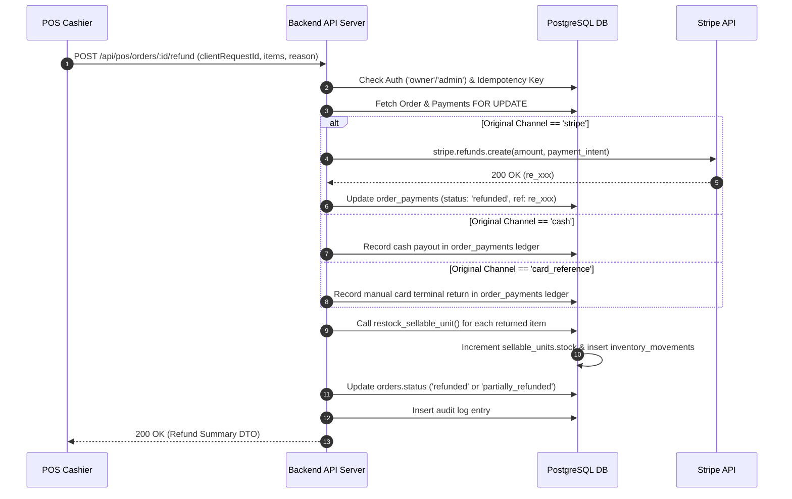

# Refund & Restock Contract

## 1. Architectural Contract Specification

| Contract Identifier | Classification | Scope | Authoritative Source |
| :--- | :--- | :--- | :--- |
| **DR-REF-001** | **FROZEN CONTRACT** | Order Returns & Inventory Restock | Repository Architecture Freeze |

### Invariant Rules:
1. **Channel-Dictated Refund Execution**: The refund method is strictly dictated by the original transaction's payment channel in `order_payments`:
   - **`stripe`**: Must call the Stripe Refund API (`stripe.refunds.create({ payment_intent: ... })`).
   - **`cash`**: Recorded as an internal cash payout in `order_payments`. **MUST NOT** invoke Stripe.
   - **`card_reference`**: Recorded as an external terminal card refund reference. **MUST NOT** invoke Stripe.
2. **Exact SellableUnit Restock**: Restocking must restore inventory to the exact `sellable_unit_id` specified in the line item. Restocking to arbitrary parent products without unit tracking is prohibited.
3. **Idempotent Refund Execution**: Every refund request must provide a `clientRequestId` (or `Idempotency-Key`). Re-issuing the same key will not restock items or refund funds twice.
4. **Order Status Alignment**:
   - If 100% of items/funds are refunded, the order status transitions to `'refunded'`.
   - If a partial subset is refunded, the status transitions to `'partially_refunded'`.
5. **Partial Refund Safeguards**: Cumulative refunded amounts must never exceed the original captured payment amount ($\sum \text{refunded\_amount} \le \text{amount}$).

---

## 2. Refund Execution Workflow



---

## 3. Database Stored Procedure (`execute_order_refund`)

```sql
CREATE OR REPLACE FUNCTION execute_order_refund(
  order_id_input UUID,
  refund_items_input JSONB, -- Array of { "order_item_id": "uuid", "quantity": int, "restock": boolean }
  refund_amount_input DECIMAL(10,2),
  actor_user_id_input UUID,
  reason_input TEXT DEFAULT 'Customer return'
)
RETURNS TABLE (
  success BOOLEAN,
  final_order_status TEXT,
  total_refunded DECIMAL(10,2)
) AS $$
DECLARE
  order_record orders%ROWTYPE;
  payment_record order_payments%ROWTYPE;
  item RECORD;
  target_item order_items%ROWTYPE;
  new_cumulative_refund DECIMAL(10,2);
  all_items_refunded BOOLEAN := true;
BEGIN
  -- 1. Lock the order and verify payable state
  SELECT * INTO order_record
  FROM orders
  WHERE id = order_id_input
  FOR UPDATE;

  IF NOT FOUND THEN
    RAISE EXCEPTION 'ORDER_NOT_FOUND: %', order_id_input;
  END IF;

  IF order_record.status NOT IN ('pagado', 'partially_refunded') THEN
    RAISE EXCEPTION 'ORDER_STATE_CONFLICT: Order cannot be refunded in state %', order_record.status;
  END IF;

  -- 2. Verify payment ledger capacity
  SELECT * INTO payment_record
  FROM order_payments
  WHERE order_id = order_id_input AND status = 'captured'
  ORDER BY created_at ASC
  LIMIT 1
  FOR UPDATE;

  IF NOT FOUND THEN
    RAISE EXCEPTION 'PAYMENT_REQUIRED: No captured payment found for order';
  END IF;

  new_cumulative_refund := order_record.refunded_amount + refund_amount_input;
  IF new_cumulative_refund > order_record.total THEN
    RAISE EXCEPTION 'REFUND_NOT_ALLOWED: Refund amount exceeds order total';
  END IF;

  -- 3. Process item restock
  FOR item IN
    SELECT
      (val->>'order_item_id')::UUID AS item_id,
      (val->>'quantity')::INT AS qty,
      (val->>'restock')::BOOLEAN AS should_restock
    FROM jsonb_array_elements(refund_items_input) AS val
  LOOP
    SELECT * INTO target_item
    FROM order_items
    WHERE id = item.item_id AND order_id = order_id_input;

    IF NOT FOUND THEN
      RAISE EXCEPTION 'ORDER_ITEM_NOT_FOUND: %', item.item_id;
    END IF;

    IF item.should_restock AND target_item.sellable_unit_id IS NOT NULL THEN
      PERFORM restock_sellable_unit(
        target_item.sellable_unit_id,
        item.qty,
        order_id_input,
        'refund',
        reason_input
      );
    END IF;
  END LOOP;

  -- 4. Update order and payment ledger
  UPDATE order_payments
  SET refunded_amount = refunded_amount + refund_amount_input,
      status = CASE
        WHEN refunded_amount + refund_amount_input >= amount THEN 'refunded'
        ELSE 'partially_refunded'
      END,
      updated_at = NOW()
  WHERE id = payment_record.id;

  UPDATE orders
  SET refunded_amount = new_cumulative_refund,
      refunded_at = NOW(),
      status = CASE
        WHEN new_cumulative_refund >= total THEN 'refunded'
        ELSE 'partially_refunded'
      END,
      updated_at = NOW()
  WHERE id = order_id_input
  RETURNING status INTO order_record.status;

  -- 5. Audit log
  INSERT INTO audit_logs (
    actor_user_id,
    action,
    entity_type,
    entity_id,
    metadata
  ) VALUES (
    actor_user_id_input,
    'order_refund',
    'order',
    order_id_input::TEXT,
    jsonb_build_object(
      'amount', refund_amount_input,
      'reason', reason_input,
      'payment_channel', payment_record.payment_channel
    )
  );

  RETURN QUERY SELECT true, order_record.status::TEXT, new_cumulative_refund;
END;
$$ LANGUAGE plpgsql SECURITY DEFINER SET search_path = public, pg_temp;
```

---

## 4. REST Endpoint Contract (`POST /api/pos/orders/:id/refund`)

#### Request Headers
- `Authorization`: `Bearer <jwt_token>`
- `Content-Type`: `application/json`

#### Request Payload
```json
{
  "clientRequestId": "e47ac10b-58cc-4372-a567-0e02b2c3d479",
  "amount": 450.00,
  "reason": "Customer changed mind",
  "items": [
    {
      "orderItemId": "7fa85f64-5717-4562-b3fc-2c963f66af01",
      "quantity": 1,
      "restock": true
    }
  ],
  "cardTerminalApproval": "RET-884129"
}
```

#### Success Response (`HTTP 200 OK`)
```json
{
  "orderId": "3fa85f64-5717-4562-b3fc-2c963f66afa6",
  "status": "partially_refunded",
  "refundedAmount": 450.00,
  "totalOrderRefunded": 450.00,
  "restockedUnits": [
    {
      "sellableUnitId": "8b9a12c4-2391-4cf4-912f-683e98129abc",
      "quantity": 1,
      "newStock": 15
    }
  ],
  "payment": {
    "channel": "cash",
    "refundReference": null,
    "status": "partially_refunded"
  }
}
```
