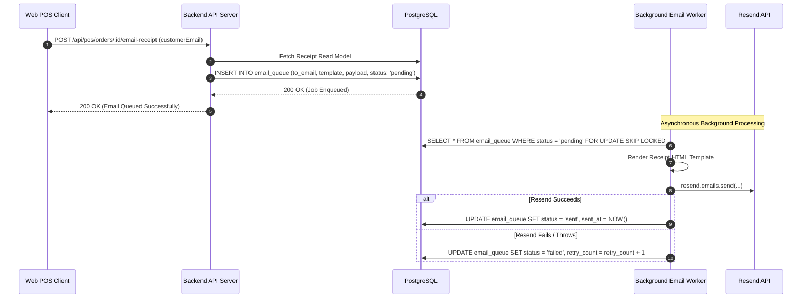

# Receipt Read Model & Delivery Contract (DR-REC-001)

## 1. Architectural Contract Specification

| Contract Identifier | Classification | Scope | Authoritative Source |
| :--- | :--- | :--- | :--- |
| **DR-REC-001** | **FROZEN CONTRACT** | Post-Sale Read Model & Communications | Repository Architecture Freeze |

### Invariant Rules:
1. **Deterministic Read Model**: The receipt is a strictly derived, pure read model generated from persisted immutable records in `orders`, `order_items`, `sellable_units`, and `order_payments`. It contains no transient or unpersisted state.
2. **Failure Isolation**: Delivery of a digital receipt via transactional email is completely decoupled from the sale transaction. An email delivery failure, SMTP error, or Resend outage **MUST NEVER roll back a completed financial transaction or stock decrement**.
3. **Queue-Backed Dispatch**: All transactional receipt emails must be enqueued into the persistent PostgreSQL `email_queue` table and picked up by the asynchronous worker process.
4. **Standard Thermal Format**: The receipt presentation model must natively format for standard 80mm roll thermal receipt printers using pure browser CSS (`@media print`), eliminating requirements for native ESC/POS hardware drivers.

---

## 2. Receipt Read Model Data Schema

```json
{
  "store": {
    "name": "Selfcare Sinners",
    "legalName": "Selfcare Sinners S.A. de C.V.",
    "website": "https://selfcaresinners.com",
    "phone": "+52 (55) 1234-5678",
    "address": "Av. Insurgentes Sur 1234, CDMX, Mexico"
  },
  "receipt": {
    "receiptNumber": "REC-20260928-0042",
    "orderId": "3fa85f64-5717-4562-b3fc-2c963f66afa6",
    "issuedAt": "2026-09-28T07:15:30Z",
    "formattedDate": "28/09/2026 01:15 AM",
    "channel": "pos_register",
    "terminalId": "TERM-POS-01",
    "cashierName": "Julian Staff",
    "customerEmail": "customer@example.com"
  },
  "items": [
    {
      "sku": "SKU-SERUM-50ML",
      "title": "Revitalizing Night Serum",
      "variantTitle": "50ml Glass Bottle",
      "quantity": 2,
      "unitPriceFormatted": "$450.00 MXN",
      "totalPriceFormatted": "$900.00 MXN"
    }
  ],
  "financials": {
    "subtotalFormatted": "$900.00 MXN",
    "discountFormatted": "$0.00 MXN",
    "taxFormatted": "$0.00 MXN",
    "totalFormatted": "$900.00 MXN"
  },
  "tender": {
    "channel": "cash",
    "channelLabel": "Efectivo",
    "amountTenderedFormatted": "$1,000.00 MXN",
    "changeGivenFormatted": "$100.00 MXN",
    "referenceCode": null
  },
  "footer": {
    "policyNotes": "Cambios y devoluciones dentro de los 15 días presentando este comprobante.",
    "barcodeValue": "REC-20260928-0042"
  }
}
```

---

## 3. Asynchronous Email Queue Integration

When digital receipt delivery is requested during checkout or post-sale, the API persists an email job to the queue within the same transaction or immediately post-commit:



### Safety Guarantee:
If `Resend` fails or the network times out during email dispatch, the order and payment remain 100% committed and intact. Cashiers can re-trigger email sending or print a paper receipt.

---

## 4. Browser Thermal Print Stylesheet Specification (`@media print`)

To guarantee crisp, unclipped 80mm thermal receipt printing from any web browser, the POS print modal uses the following CSS rules:

```css
@media print {
  @page {
    margin: 0;
    size: 80mm auto;
  }

  body {
    margin: 0;
    padding: 2mm;
    background: #ffffff;
    color: #000000;
    font-family: 'Courier New', Courier, monospace;
    font-size: 11px;
    line-height: 1.25;
    -webkit-print-color-adjust: exact;
  }

  .no-print {
    display: none !important;
  }

  .receipt-container {
    width: 76mm;
    margin: 0 auto;
    page-break-after: avoid;
  }

  .receipt-header {
    text-align: center;
    border-bottom: 1px dashed #000;
    padding-bottom: 4mm;
    margin-bottom: 3mm;
  }

  .receipt-items-table {
    width: 100%;
    border-collapse: collapse;
    margin-bottom: 3mm;
  }

  .receipt-items-table th,
  .receipt-items-table td {
    text-align: left;
    padding: 1mm 0;
  }

  .receipt-items-table .text-right {
    text-align: right;
  }

  .receipt-totals {
    border-top: 1px dashed #000;
    padding-top: 2mm;
    margin-bottom: 3mm;
  }

  .receipt-footer {
    text-align: center;
    border-top: 1px dashed #000;
    padding-top: 3mm;
    font-size: 10px;
  }
}
```

---

## 5. REST Endpoints

### 5.1 `GET /api/pos/orders/:id/receipt`
Retrieves the computed receipt read model.
- **Authorization**: `requirePosOperator` (`owner` or `admin`).
- **Response**: JSON conforming to the schema in Section 2.

### 5.2 `POST /api/pos/orders/:id/email-receipt`
Enqueues a digital receipt email.
- **Authorization**: `requirePosOperator` (`owner` or `admin`).
- **Request Body**:
  ```json
  {
    "email": "customer@example.com"
  }
  ```
- **Response (`202 Accepted`)**:
  ```json
  {
    "success": true,
    "message": "Receipt email enqueued successfully",
    "queueId": "a9b8c7d6-e5f4-3210-fedc-ba9876543210"
  }
  ```
