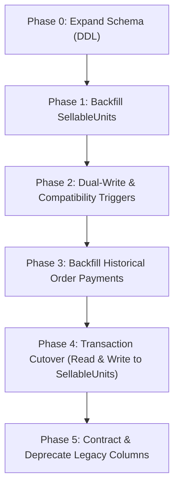

# Data Migration Strategy & Phased Zero-Downtime Rollout

## 1. Executive Summary

This document specifies the phased, non-destructive data migration strategy to transition the production platform from legacy monolithic product stock (`products.stock` and `variants` JSONB) to the canonical `sellable_units` table and `order_payments` ledger.

To guarantee zero downtime and zero data loss on production (`selfcaresinners.com`), migration follows an expand-contract architecture across five distinct phases.

---

## 2. 5-Phase Non-Destructive Migration Plan



---

### Phase 0: Expand Schema (DDL)
- **Goal**: Provision all new tables, types, and indexes without modifying existing query behavior.
- **Actions**:
  1. Create `sellable_units` table with foreign key `product_id REFERENCES products(id)`.
  2. Create `order_payments` table with foreign key `order_id REFERENCES orders(id)`.
  3. Create `idempotency_records` table.
  4. Add nullable columns `sellable_unit_id` to `order_items` and `inventory_movements`.
  5. Add nullable `client_request_id`, `channel`, `cashier_user_id` to `orders`.
- **Downtime**: 0 seconds (All DDL operations use `IF NOT EXISTS` and nullable columns).

---

### Phase 1: Backfill SellableUnits
- **Goal**: Populate `sellable_units` from existing `products` records.
- **Logic**:
  - **Standalone Products (No Variants)**: Create 1 `sellable_unit` record per product using `products.sku` (or synthesized `SKU-<SLUG>`), `title = products.name`, `stock = products.stock`.
  - **Variant Products (Variants in JSONB)**: Iterate through `products.variants` array; insert 1 `sellable_unit` per item using the variant's SKU, title, and stock.

```sql
-- Phase 1 Backfill Script: Standalone Products
INSERT INTO sellable_units (product_id, sku, title, price_override, stock, status)
SELECT
  p.id,
  COALESCE(p.sku, 'SKU-' || UPPER(REPLACE(p.slug, '-', ''))),
  p.name,
  NULL, -- Uses base price
  p.stock,
  CASE WHEN p.status = 'active' THEN 'active' ELSE 'archived' END
FROM products p
WHERE (p.variants IS NULL OR jsonb_array_length(p.variants) = 0)
ON CONFLICT (sku) DO NOTHING;

-- Phase 1 Backfill Script: Products with JSONB Variants
INSERT INTO sellable_units (product_id, sku, title, price_override, stock, status, attributes)
SELECT
  p.id,
  COALESCE(v->>'sku', p.sku || '-' || UPPER(COALESCE(v->>'title', 'VAR'))),
  p.name || ' (' || COALESCE(v->>'title', 'Standard') || ')',
  (v->>'price')::DECIMAL,
  COALESCE((v->>'stock')::INT, 0),
  'active',
  v
FROM products p,
LATERAL jsonb_array_elements(p.variants) AS v
WHERE p.variants IS NOT NULL AND jsonb_array_length(p.variants) > 0
ON CONFLICT (sku) DO NOTHING;
```

---

### Phase 2: Dual-Write & Compatibility Triggers
- **Goal**: Keep `products.stock` and `sellable_units.stock` in perfect real-time sync during the transition window.
- **Actions**:
  - Install PostgreSQL trigger `trg_sync_parent_product_stock` on `sellable_units` that sums unit stock into `products.stock` on every mutation.
  - Install reverse trigger on `products.stock` updating default units for legacy admin operations.

---

### Phase 3: Backfill Historical Order Payments
- **Goal**: Populate `order_payments` ledger from historical `orders` records.
- **Logic**:
  - For every paid order (`status = 'pagado'`), insert a captured payment record with `payment_channel = 'stripe'`.
  - Use `orders.stripe_payment_intent_id` as `reference_code` and create an idempotency key `legacy-order-<order_id>`.

```sql
INSERT INTO order_payments (
  order_id,
  payment_channel,
  amount,
  currency,
  status,
  idempotency_key,
  reference_code,
  created_at
)
SELECT
  o.id,
  'stripe',
  o.total,
  COALESCE(o.currency, 'mxn'),
  'captured',
  'legacy-order-' || o.id::TEXT,
  o.stripe_payment_intent_id,
  o.created_at
FROM orders o
WHERE o.status IN ('pagado', 'empacado', 'enviado', 'entregado')
  AND NOT EXISTS (SELECT 1 FROM order_payments p WHERE p.order_id = o.id);
```

---

### Phase 4: Transaction Cutover (Read & Write to SellableUnits)
- **Goal**: Enable the Web POS and switch online checkout finalization (`finalize_paid_order`) to exclusively decrement `sellable_units` via `decrement_sellable_unit_stock`.
- **Actions**:
  - Deploy updated backend server code (`server.ts`).
  - Deploy Web POS application.
  - Validate that new sales insert both `orders`, `order_items` (with `sellable_unit_id`), and `order_payments`.

---

### Phase 5: Contract & Deprecate Legacy Columns
- **Goal**: Freeze legacy fields to prevent regression.
- **Actions**:
  - `products.stock` is marked read-only or converted into a computed view.
  - Remove synchronization triggers once all legacy queries are retired.

---

## 3. Data Integrity & Reconciliation Scripts

Before cutting over Phase 4, the following verification queries must return 0 defects:

```sql
-- Verification Query 1: Unmapped products without SellableUnits
SELECT p.id, p.name, p.sku
FROM products p
LEFT JOIN sellable_units su ON su.product_id = p.id
WHERE su.id IS NULL;
-- EXPECTED RESULT: 0 rows

-- Verification Query 2: Stock mismatch between products and sum of sellable_units
SELECT
  p.id,
  p.name,
  p.stock AS product_stock,
  SUM(su.stock) AS units_stock_sum,
  (p.stock - SUM(su.stock)) AS discrepancy
FROM products p
JOIN sellable_units su ON su.product_id = p.id
GROUP BY p.id, p.name, p.stock
HAVING p.stock <> SUM(su.stock);
-- EXPECTED RESULT: 0 rows

-- Verification Query 3: Paid orders without captured order_payments
SELECT o.id, o.total, o.created_at
FROM orders o
LEFT JOIN order_payments op ON op.order_id = o.id AND op.status = 'captured'
WHERE o.status IN ('pagado', 'empacado', 'enviado', 'entregado')
  AND op.id IS NULL;
-- EXPECTED RESULT: 0 rows
```

---

## 4. Rollback & Contingency Procedures

If an unrecoverable failure occurs during Phase 4 cutover:
1. **Feature Flag Reversal**: Set `USE_SELLABLE_UNIT_INVENTORY=false` in environment variables.
2. **Traffic Fallback**: Online checkouts instantly revert to locking `products.stock` via existing `decrement_stock` RPC.
3. **Data Preservation**: Dual-write triggers installed in Phase 2 ensure `products.stock` remains accurate even if POS sales occurred.
4. **No Drop Rule**: `sellable_units` and `order_payments` tables are never dropped during an emergency rollback.
