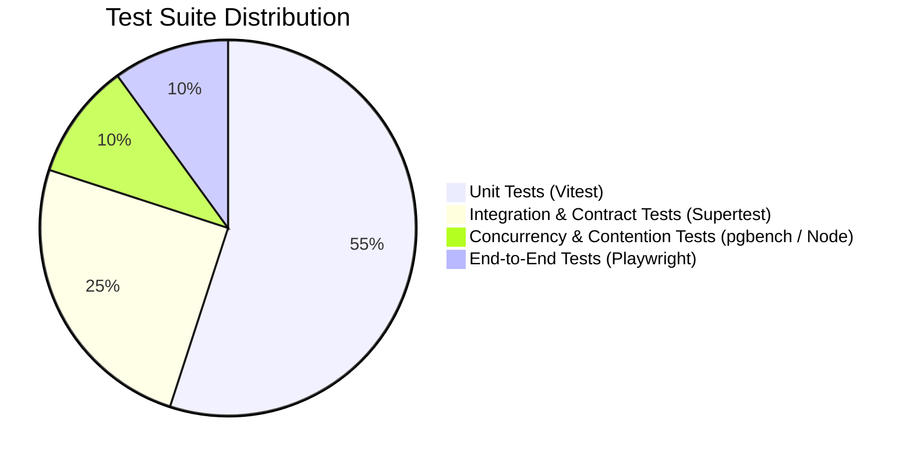

# Client 01 Testing Strategy & Concurrency Validation

## 1. Executive Summary

This document specifies the testing strategy, test pyramid tiers, automated test suites, and concurrency verification protocols for the Client 01 platform. 

A central requirement of Client 01 is proving zero overselling under heavy simultaneous contention between online web shoppers and in-person POS sales.

---

## 2. Test Pyramid & Coverage Targets



### Coverage Objectives
- **Unit Test Coverage**: $\ge 85\%$ lines, $100\%$ branches on pricing, tax, cash change, and idempotency hashing logic.
- **Contract Coverage**: $100\%$ of endpoints documented in `09_POS_API_CONTRACT.md` validated against DR-ERR-001 error envelopes.
- **Zero-Oversell Invariant**: $100\%$ pass rate on high-contention concurrent stock deduction tests.

---

## 3. High-Contention Concurrency Test Specification

### 3.1 The Race Condition Scenario
50 concurrent requests (mix of online Stripe webhooks and POS cash transactions) compete simultaneously for a limited inventory of 10 physical units of a single `SellableUnit`.

```
Initial State: sellable_units.stock = 10
Incoming Traffic: 50 parallel requests requesting 1 unit each
Expected Final State: sellable_units.stock = 0
Expected HTTP Results: Exactly 10 x HTTP 201/200; Exactly 40 x HTTP 409 (INSUFFICIENT_STOCK)
Discrepancy Allowed: 0 units
```

### 3.2 Automated Concurrency Test Script (`tests/concurrency/stock-contention.test.ts`)

```typescript
import { describe, it, expect, beforeAll } from 'vitest';
import { supabaseAdmin } from '../../src/lib/supabase';
import { decrementSellableUnitStock } from '../../src/services/inventory-service';
import { randomUUID } from 'crypto';

describe('High-Contention Inventory Concurrency (DR-INV-001)', () => {
  let testUnitId: string;
  const initialStock = 10;
  const concurrentCallers = 50;

  beforeAll(async () => {
    // Seed an isolated test sellable unit with 10 units of stock
    const { data: unit, error } = await supabaseAdmin
      .from('sellable_units')
      .insert({
        sku: `TEST-CONCURRENCY-${Date.now()}`,
        title: 'Concurrency Benchmark Serum',
        stock: initialStock,
        status: 'active'
      })
      .select('id')
      .single();

    if (error || !unit) throw new Error(`Failed to seed test unit: ${error?.message}`);
    testUnitId = unit.id;
  });

  it('guarantees zero oversell under 50 simultaneous competing requests', async () => {
    const promises = Array.from({ length: concurrentCallers }).map(async (_, idx) => {
      const dummyOrderId = randomUUID();
      try {
        const result = await decrementSellableUnitStock({
          items: [{ sellableUnitId: testUnitId, quantity: 1 }],
          orderId: dummyOrderId,
          reason: 'sale',
          notes: `Concurrency test worker #${idx}`
        });
        return { success: result.success, errorCode: result.errorCode };
      } catch (err: any) {
        return { success: false, errorCode: err.message };
      }
    });

    const results = await Promise.all(promises);

    const successCount = results.filter((r) => r.success).length;
    const failureCount = results.filter((r) => !r.success && r.errorCode === 'INSUFFICIENT_STOCK').length;

    // Verify exact fulfillment
    expect(successCount).toBe(initialStock);
    expect(failureCount).toBe(concurrentCallers - initialStock);

    // Verify database row state
    const { data: finalUnit } = await supabaseAdmin
      .from('sellable_units')
      .select('stock')
      .eq('id', testUnitId)
      .single();

    expect(finalUnit?.stock).toBe(0);

    // Verify inventory movement records match exactly 10 decrements
    const { count: movementsCount } = await supabaseAdmin
      .from('inventory_movements')
      .select('id', { count: 'exact' })
      .eq('sellable_unit_id', testUnitId);

    expect(movementsCount).toBe(initialStock);
  });
});
```

---

## 4. Playwright End-to-End Suite Specifications

### Suite E2E-POS-01: POS Cash Sale Flow (`tests/e2e/pos-cash-sale.spec.ts`)
1. Log in as an `admin` staff user.
2. Navigate to `/admin/pos` (Web POS interface).
3. Search for product `SKU-SERUM-50ML` in the catalog bar.
4. Add 2 units to the cart.
5. Verify server subtotal displays `$900.00 MXN`.
6. Click "Cobrar (Tender)".
7. Select "Efectivo (Cash)".
8. Enter `$1,000.00` in the "Monto recibido (Amount Tendered)" input.
9. Assert that "Cambio (Change Due)" displays `$100.00 MXN`.
10. Click "Finalizar Venta (Complete Sale)".
11. Assert that the Receipt Modal opens with receipt number `REC-...`.
12. Assert that stock in DB decreased by 2.

### Suite E2E-POS-02: POS Card Reference Flow (`tests/e2e/pos-card-sale.spec.ts`)
1. Add items to cart totaling `$450.00 MXN`.
2. Select "Tarjeta / Terminal Externa (Card Reference)".
3. Verify sale submission is disabled until reference code has $\ge 4$ characters.
4. Enter authorization code `AUTH-991204`.
5. Submit transaction.
6. Verify order created in `orders` table with `channel = 'pos_register'`.
7. Verify `order_payments` table has 1 record with `payment_channel = 'card_reference'` and `reference_code = 'AUTH-991204'`.

---

## 5. Automated Quality Gates

Every CI build enforces the following hard quality gates:

```bash
# 1. FAST Gate (Local & CI)
npm run typecheck       # Zero TypeScript errors
npm run test:unit       # All Vitest unit tests pass
npm run build           # Vite + Esbuild production compilation succeeds

# 2. RELEASE Gate
npm run test:concurrency # Zero oversell verification
npm run test:contract    # Supertest API envelope verification
npm run test:e2e         # Playwright headless browser suites pass
scripts/qa/security/scan-local-secrets.ps1 # Secret leak scan
```
