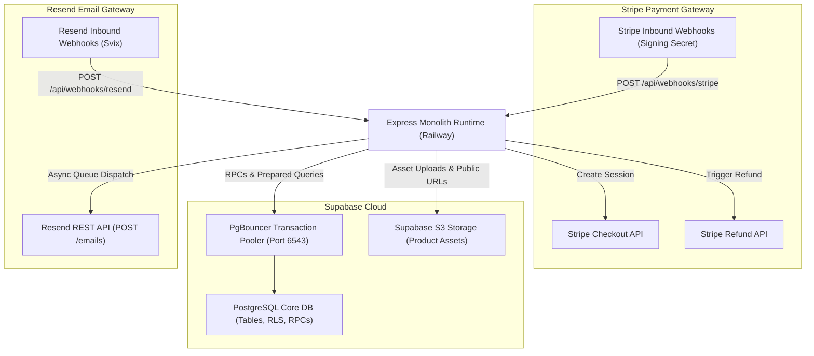

# External Integration Strategy & Resilience Patterns

## 1. Executive Summary

This document specifies the integration architecture, connection topologies, resilience patterns, and failure modes across the three authoritative external service dependencies for Client 01:
1. **Supabase Cloud (PostgreSQL & Storage)**
2. **Stripe API (Payment Processing)**
3. **Resend API (Transactional Email)**

---

## 2. Service Integration Architecture



---

## 3. Database Integration (Supabase Cloud)

### 3.1 Connection Topologies
- **Transaction Pooler (Port 6543)**: Default connection pool used by the Express backend (`SUPABASE_DB_URL`). Prevents connection starvation during traffic spikes.
- **Direct Database Access (Port 5432)**: Reserved strictly for local schema migrations and non-pooled admin scripts.
- **Supabase JavaScript Client**: Configured with persistent retry options and automatic session refreshes using `@supabase/supabase-js`.

### 3.2 Resilience & RPC Timeout Standards
- All database queries must enforce an explicit statement timeout (`statement_timeout = 5000` ms) to prevent lock freezes.
- RPC calls invoking `decrement_sellable_unit_stock` must handle transient lock acquisition failures (`55P03: lock_not_available`) by catching the exception and returning `409 INVENTORY_CONFLICT`.

---

## 4. Payment Gateway Integration (Stripe API)

### 4.1 Stripe API Client Configuration
- **API Version**: `2024-06-20` (Pinned).
- **Timeout**: 8,000 ms per HTTP request.
- **Max Retries**: 2 automatic retries on idempotent network failures (`ETIMEDOUT`, `ECONNRESET`).

### 4.2 Webhook Signature & Order Finalization
- Route: `POST /api/webhooks/stripe`.
- Security: Cryptographically verified against `STRIPE_WEBHOOK_SECRET` using `stripe.webhooks.constructEvent`.
- Event Handling:
  - `checkout.session.completed`: Invokes `finalize_paid_order` stored procedure.
  - `charge.refunded`: Updates `order_payments.status` to `refunded` or `partially_refunded`.
- Idempotency: Incoming event IDs are recorded in `stripe_events`. Re-delivered events return `200 OK` without re-executing logic.

### 4.3 POS Channel Isolation
- **Rule**: POS Cash sales and Card Reference sales **never make calls to the Stripe API**.
- POS terminal transactions operate entirely within PostgreSQL, preserving Stripe API rate limits and preventing contamination of Stripe reporting.

---

## 5. Transactional Communications (Resend API)

### 5.1 Asynchronous Queue & Isolation
- To satisfy **DR-REC-001**, emails are never dispatched synchronously in the request/response lifecycle of a sale.
- When an order completes, a record is inserted into `email_queue`.
- A background worker (`email-worker.ts`) polls the queue every 5 seconds:
  ```typescript
  const { data: jobs } = await supabaseAdmin
    .from('email_queue')
    .select('*')
    .eq('status', 'pending')
    .limit(10)
    .order('created_at', { ascending: true });
  ```

### 5.2 Retry Policy & Dead-Letter Handling
- Maximum retry attempts: 3.
- Backoff strategy: Exponential ($30\text{s}, 120\text{s}, 600\text{s}$).
- Upon third failure, status is updated to `'dead_letter'`, and an error is dispatched to Sentry for administrative inspection.

---

## 6. Resilience & Circuit Breaker Matrix

| Integration | Primary Failure Mode | System Defense / Mitigation | Customer / Operator Impact |
| :--- | :--- | :--- | :--- |
| **Supabase DB** | Connection pool exhausted | `p-retry` exponential backoff (3 attempts, max 1.5s) | Client receives `409 INVENTORY_CONFLICT` or `500 INTERNAL_ERROR` |
| **Stripe API** | Stripe outage during checkout | Timeout after 8s; graceful error display | Online checkout displays "Payment provider temporarily unavailable" |
| **Stripe Webhook** | Railway container restart | Stripe auto-retries webhook delivery for 72 hours | Order finalizes on next webhook attempt; zero data loss |
| **Resend API** | Resend rate limit / 5xx error | Asynchronous email queue worker retries with exponential backoff | Sale succeeds; customer receives digital receipt with minor delay |
