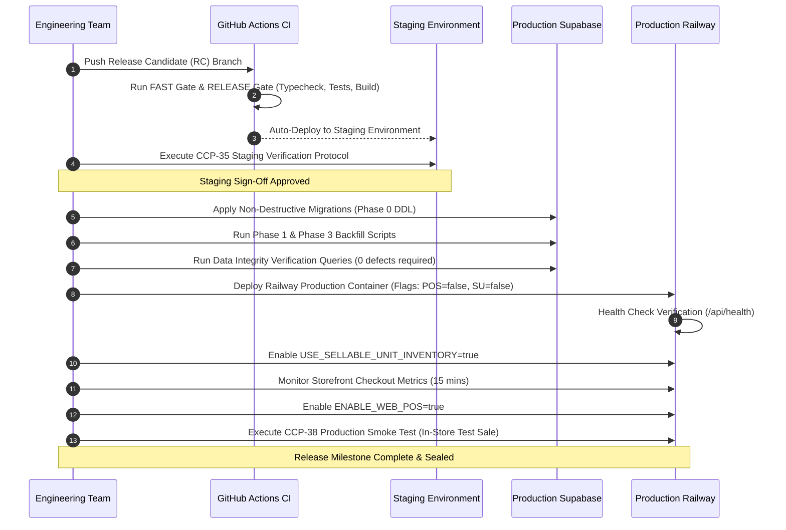

# Release Strategy, Feature Flags & Rollback Procedures

## 1. Executive Summary

This document specifies the progressive rollout sequence, feature flag architecture, pre-release staging gates, and automated rollback thresholds for Client 01.

All deployments to production (`https://selfcaresinners.com`) must strictly execute this protocol.

---

## 2. Feature Flags Architecture

Client 01 introduces two runtime environment feature flags to decouple code deployment from feature exposure:

| Flag Name | Type | Default | Purpose |
| :--- | :--- | :--- | :--- |
| `ENABLE_WEB_POS` | Boolean (`true`/`false`) | `false` | Enables Web POS routes (`/admin/pos`) and operational POS backend endpoints (`/api/pos/*`). When false, endpoints return `404 Not Found` and UI navigation is hidden. |
| `USE_SELLABLE_UNIT_INVENTORY` | Boolean (`true`/`false`) | `false` | Switches online checkout stock decrements from legacy `decrement_stock` to `decrement_sellable_unit_stock`. |

---

## 3. Deployment Sequence



---

## 4. Staging Verification Gate (CCP-35)

Before promoting to production, staging must achieve 100% pass marks on the following preflight checklist:
- [ ] Schema migration applied cleanly with zero errors.
- [ ] Existing products backfilled into `sellable_units` (count matches 1:1 or 1:N).
- [ ] Web POS accessible to `admin` and `owner` accounts.
- [ ] Web POS blocked with `403 FORBIDDEN` for `user` and `support` accounts.
- [ ] Cash sale successfully completes with correct change calculation and receipt rendering.
- [ ] Card reference sale successfully completes with reference code logged.
- [ ] Stock decrement is immediately reflected in both `sellable_units` and `products.stock`.
- [ ] 50-request concurrent stock contention test passes with 0 oversells.

---

## 5. Rollback Triggers & Emergency Rollback Procedures

### 5.1 Automated Rollback Thresholds
Immediate rollback is triggered if any of the following occur within the first 60 minutes of production release:
1. **5xx Error Spike**: Unhandled backend errors exceed $0.5\%$ of total request volume.
2. **Stock Discrepancy**: Any negative stock count or discrepancy detected between `sellable_units` and `products.stock`.
3. **Idempotency Failures**: Duplicate orders created with identical `client_request_id`.
4. **Payment Ledger Mismatch**: Any order where captured payment total does not equal order total.

### 5.2 Rollback Action Steps
1. **Emergency Flag Deactivation** (Under 60 seconds):
   - In Railway dashboard, set:
     ```env
     ENABLE_WEB_POS=false
     USE_SELLABLE_UNIT_INVENTORY=false
     ```
   - Restart container.
2. **Traffic Fallback**:
   - The platform instantly reverts to legacy single-entity product inventory.
   - Cashiers revert to paper ledger or paused register operations.
3. **Post-Rollback Data Audit**:
   - Run reconciliation queries to identify any orders processed during the window.
   - Reverse triggers preserve inventory balance. No database tables are dropped.
