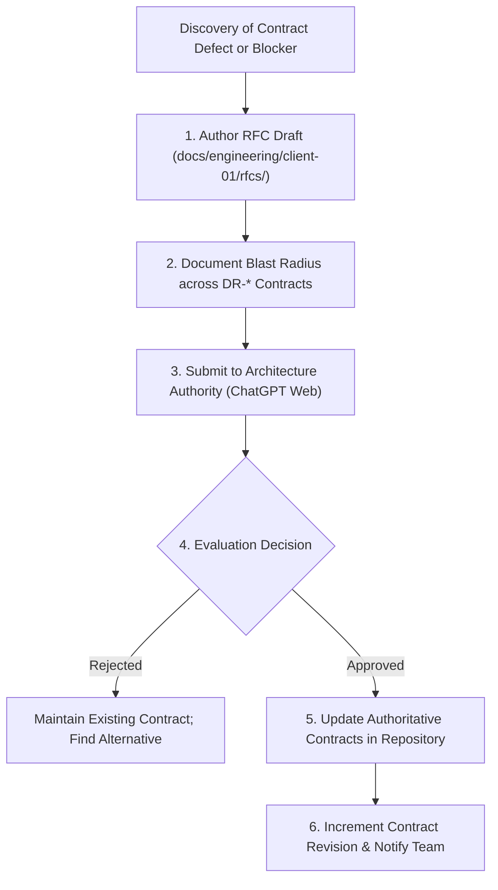

# Architecture Governance & Change Control Process

## 1. Executive Summary

This document establishes the formal change control procedures governing architectural modifications, interface contract adjustments, and schema evolution for Client 01.

Because contracts in this repository represent hard boundaries shared across autonomous agents and human engineering teams, uncoordinated modifications to frozen contracts are strictly prohibited.

---

## 2. Decision Classification & Modification Authority

Every technical element is classified into one of four governance tiers:

| Tier | Classification | Examples | Modification Authority |
| :--- | :--- | :--- | :--- |
| **Tier 1** | **FROZEN REQUIREMENT** | Single-merchant scope, exclusion of offline POS, no external card terminal SDK, MXN currency | Product Owner / User Authority |
| **Tier 2** | **FROZEN CONTRACT** | DR-INV-001, DR-PAY-001, DR-IDEM-001, DR-AUTH-001, DR-ERR-001, DR-REC-001 | Architecture Lead (ChatGPT Web) |
| **Tier 3** | **DERIVED ENGINEERING DESIGN** | Migration phasing, RPC locking order, Zod validation schemas, component hierarchies | Lead Engineers (Julian / Rogelio) |
| **Tier 4** | **ENGINEER CHOICE** | Internal helper names, UI Tailwind utility classes, unit test fixtures | Assigned Implementing Engineer |

---

## 3. Contract Amendment RFC Process

If an implementation reality or external blocker necessitates altering a **FROZEN CONTRACT (Tier 2)** or **FROZEN REQUIREMENT (Tier 1)**, the engineer must execute the formal RFC amendment workflow:

### Required Sections for an RFC:
1. **RFC Title & Target Contract**: (e.g. `RFC-001: Addition of Split-Tender Support to DR-PAY-001`)
2. **Context & Motivation**: Why the current contract is insufficient or blocking.
3. **Proposed Specification**: Exact delta to SQL DDL, JSON payload schemas, or state transitions.
4. **Blast Radius & Impact Analysis**: Detailed listing of every ticket execution pack affected.
5. **Backwards Compatibility & Migration**: How existing records and in-flight traffic will be preserved.
6. **Approval Signatures**: Explicit recorded approval from ChatGPT Web.

---

## 4. API & Database Versioning Standards

### 4.1 REST API Versioning
- All POS APIs are scoped under `/api/pos/v1/...` or `/api/pos/...` with semantic stability.
- **Additive Changes**: Adding optional request fields or new response fields is considered non-breaking and does not require a version bump.
- **Breaking Changes**: Modifying required fields, deleting fields, or changing HTTP status codes requires a new route namespace (e.g. `/api/pos/v2/...`).

### 4.2 Database Migration Versioning
- Migration files are stored in `supabase/migrations/` and named using standard chronological timestamps:
  `YYYYMMDDHHMMSS_<ticket_id>_<descriptive_name>.sql`
- Migrations must be strictly additive and idempotent (`CREATE TABLE IF NOT EXISTS`, `ADD COLUMN IF NOT EXISTS`).
- `DROP` statements targeting tables or columns in production require a two-release deprecation window.
