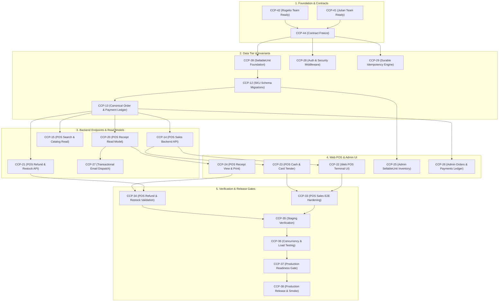

# Client 01 Architecture & Engineering Specification Index

## 1. Overview & Context

This documentation directory constitutes the authoritative architectural design, interface contracts, data migration strategies, and ticket execution packs for **Client 01 (Selfcare Sinners)**.

The initiative bridges the existing hardened online ecommerce platform with a high-reliability, in-browser Web Point of Sale (POS) system. It establishes a unified, single source of transactional truth across physical and digital retail channels.

### System Identity & Deployment Topology
- **Merchant Tenancy**: Dedicated Single-Merchant Instance (`Selfcare Sinners`).
- **Application Architecture**: Monolithic Node.js 22 LTS / Express 4.21 API + React 19 SPA running in a unified runtime container.
- **Database**: Managed PostgreSQL on Supabase Cloud with Row-Level Security (RLS) and stored procedures for transactional concurrency.
- **Runtime Environment**: Railway (`heroic-solace`), serving static React assets and REST API endpoints on `https://selfcaresinners.com`.
- **Payment Processing**: Stripe Checkout Sessions & Webhooks for online transactions; Cash and External Card Reference for in-person POS sales.
- **Transactional Communications**: Resend API backed by an asynchronous database queue (`email_queue`) and worker process.

---

## 2. Frozen Baseline & Architectural Invariants

All designs and execution packs in this directory are governed by six immutable design rules:

```
┌────────────────────────────────────────────────────────────────────────┐
│                      FROZEN ARCHITECTURAL CONTRACTS                     │
├────────────────────────────────────────────────────────────────────────┤
│ DR-INV-001  │ Persistent SellableUnit (SKU) transactional inventory authority│
│ DR-PAY-001  │ Canonical order_payments ledger (Stripe, Cash, Card Ref)  │
│ DR-IDEM-001 │ Durable PostgreSQL-backed idempotency engine             │
│ DR-AUTH-001 │ Role enforcement: 'owner' & 'admin' only; 'user' denied  │
│ DR-ERR-001  │ Standardized RFC-compliant error envelope                │
│ DR-REC-001  │ Deterministic receipt read model & non-blocking delivery │
└────────────────────────────────────────────────────────────────────────┘
```

### Invariant Summary
1. **DR-INV-001 (Inventory Authority)**: `SellableUnit` is the exclusive transactional inventory authority. `Product` remains the catalog parent entity. Frontend stock is advisory only. Mutations use row-level database locks.
2. **DR-PAY-001 (Payment Ledger)**: All transactions must record canonical payment entries in `order_payments`. Never synthesize fake Stripe transaction IDs for cash or external card payments.
3. **DR-IDEM-001 (Idempotency Engine)**: PostgreSQL-backed idempotency. POS sales require `client_request_id` (UUID). Replays return recorded results; payload mutations with identical keys return `409 IDEMPOTENCY_CONFLICT`.
4. **DR-AUTH-001 (Authorization Model)**: POS operations are restricted strictly to `owner` and `admin` roles. No new cashier role is introduced for Client 01.
5. **DR-ERR-001 (Standard Error Envelope)**: Unified error format `{"error": {"code", "message", "details", "requestId"}}` across all endpoints.
6. **DR-REC-001 (Receipt & Read Model)**: Receipts are deterministically calculated read models. Asynchronous receipt email failures MUST NOT roll back financial transactions.

---

## 3. Decision Classification Hierarchy

Every architectural artifact and engineering task conforms to the following governance taxonomy:

1. **FROZEN REQUIREMENT**: Fixed scope boundaries and business rules established by leadership and the commercial contract. Non-negotiable.
2. **FROZEN CONTRACT**: Immutable data shapes, state machines, API interfaces, and database invariants (`DR-*`). Must not be altered without formal RFC amendment.
3. **DERIVED ENGINEERING DESIGN**: Architectural choices, database migration phases, concurrency algorithms, and middleware topologies specified to fulfill frozen contracts.
4. **ENGINEER IMPLEMENTATION CHOICE**: Internal component factoring, utility helpers, UI styling nuances, and local test structure left to the assigned engineer's professional discretion.

---

## 4. Critical Delivery Path

The execution packs under `execution/` map directly to the Jira release track:



---

## 5. Directory Index

### Core Architecture & Contract Documents
| File | Topic | Focus Area |
| :--- | :--- | :--- |
| [**`01_SCOPE.md`**](./01_SCOPE.md) | Scope Boundaries | Explicit inclusions, exclusions, and platform limitations |
| [**`02_DOMAIN_MODEL.md`**](./02_DOMAIN_MODEL.md) | Domain Model & State Machines | Entity-relationship diagrams, order/payment/stock lifecycle state machines |
| [**`03_INVENTORY_CONTRACT.md`**](./03_INVENTORY_CONTRACT.md) | DR-INV-001 Specification | `sellable_units` schema, SKU authority, atomic locking RPCs |
| [**`04_ORDER_CONTRACT.md`**](./04_ORDER_CONTRACT.md) | Canonical Order Model | Unified omnichannel order schema, item snapshots, channel tracking |
| [**`05_PAYMENT_CONTRACT.md`**](./05_PAYMENT_CONTRACT.md) | DR-PAY-001 Specification | `order_payments` ledger, tender recording, refund allocations |
| [**`06_IDEMPOTENCY_CONTRACT.md`**](./06_IDEMPOTENCY_CONTRACT.md) | DR-IDEM-001 Specification | PostgreSQL key registry, request hashing, collision detection |
| [**`07_AUTHORIZATION_CONTRACT.md`**](./07_AUTHORIZATION_CONTRACT.md) | DR-AUTH-001 Specification | Staff role matrix, endpoint security middleware, session verification |
| [**`08_ERROR_CONTRACT.md`**](./08_ERROR_CONTRACT.md) | DR-ERR-001 Specification | Canonical error envelope, HTTP status mapping, error code registry |
| [**`09_POS_API_CONTRACT.md`**](./09_POS_API_CONTRACT.md) | POS REST Endpoints | `POST /api/pos/sales`, search APIs, request/response JSON schemas |
| [**`10_REFUND_CONTRACT.md`**](./10_REFUND_CONTRACT.md) | Refund & Restock Rules | Channel-specific refund execution, restock RPCs, non-Stripe cash returns |
| [**`11_RECEIPT_CONTRACT.md`**](./11_RECEIPT_CONTRACT.md) | DR-REC-001 Specification | Deterministic receipt data schema, layout structure, email queue isolation |
| [**`12_SECURITY_INVARIANTS.md`**](./12_SECURITY_INVARIANTS.md) | Security Baseline | Zero-trust frontend pricing, SQL injection defense, RLS, audit logs |
| [**`13_DATA_MIGRATION_STRATEGY.md`**](./13_DATA_MIGRATION_STRATEGY.md) | Data Migration Plan | 5-phase zero-downtime migration, backfill scripts, reconciliation SQL |
| [**`14_TEST_STRATEGY.md`**](./14_TEST_STRATEGY.md) | Test Strategy & Concurrency | Test pyramid, unit/contract/e2e specs, high-contention oversell tests |
| [**`15_INTEGRATION_STRATEGY.md`**](./15_INTEGRATION_STRATEGY.md) | External Integrations | Supabase pooling, Stripe API/webhooks, Resend transactional engine |
| [**`16_RELEASE_STRATEGY.md`**](./16_RELEASE_STRATEGY.md) | Rollout & Feature Flags | Deployment sequence, feature flags, staging smoke gates, rollbacks |
| [**`17_CHANGE_CONTROL.md`**](./17_CHANGE_CONTROL.md) | Architecture Governance | Amendment procedures, contract RFC lifecycle, versioning |

---

### Engineer Ticket Execution Packs (`execution/`)
| Ticket | Primary Domain | Assignee Lead | Deliverable Summary |
| :--- | :--- | :--- | :--- |
| [**`CCP-39.md`**](./execution/CCP-39.md) | Data / Architecture | Julian | SellableUnit domain foundation and interface specifications |
| [**`CCP-12.md`**](./execution/CCP-12.md) | Database / Migration | Julian | `sellable_units` DDL migrations, backfill triggers, stock RPC |
| [**`CCP-13.md`**](./execution/CCP-13.md) | Database / Backend | Julian | `order_payments` ledger schema, omnichannel orders enhancement |
| [**`CCP-14.md`**](./execution/CCP-14.md) | Backend API | Julian | `POST /api/pos/sales` endpoint implementation with atomic checkout |
| [**`CCP-15.md`**](./execution/CCP-15.md) | Backend API | Julian | POS fast catalog search and sellable unit barcode/text lookup |
| [**`CCP-20.md`**](./execution/CCP-20.md) | Backend / Read Model | Julian | Receipt generation read model and deterministic computation endpoint |
| [**`CCP-21.md`**](./execution/CCP-21.md) | Backend API | Julian | POS refund and stock restock operations API |
| [**`CCP-22.md`**](./execution/CCP-22.md) | Frontend UI | Rogelio | Web POS cashier terminal register interface and cart management |
| [**`CCP-23.md`**](./execution/CCP-23.md) | Frontend UI | Rogelio | POS tender modal: Cash change calculation and Card terminal entry |
| [**`CCP-24.md`**](./execution/CCP-24.md) | Frontend UI | Rogelio | Receipt modal, browser thermal print CSS styling, email trigger UI |
| [**`CCP-25.md`**](./execution/CCP-25.md) | Frontend UI | Rogelio | Admin catalog management enhancement for SKU / SellableUnit inventory |
| [**`CCP-26.md`**](./execution/CCP-26.md) | Frontend UI | Rogelio | Admin orders and payment ledger view with tender drill-down |
| [**`CCP-27.md`**](./execution/CCP-27.md) | Backend / Email | Julian | Resend queue integration for asynchronous POS digital receipts |
| [**`CCP-28.md`**](./execution/CCP-28.md) | Security / Backend | Julian | POS role-based access control middleware and route guards |
| [**`CCP-29.md`**](./execution/CCP-29.md) | Backend / Middleware | Julian | Durable PostgreSQL idempotency engine middleware |
| [**`CCP-33.md`**](./execution/CCP-33.md) | QA Automation | QA Lead | Playwright end-to-end POS checkout and inventory validation suite |
| [**`CCP-34.md`**](./execution/CCP-34.md) | QA Automation | QA Lead | POS refund, restock, and idempotency edge-case E2E validation |

---

### Final Assessment & Sign-Off
- [**`CLIENT01_DESIGN_REPORT.md`**](./CLIENT01_DESIGN_REPORT.md): Comprehensive readiness report, contract compliance audit, and engineering handoff status.
