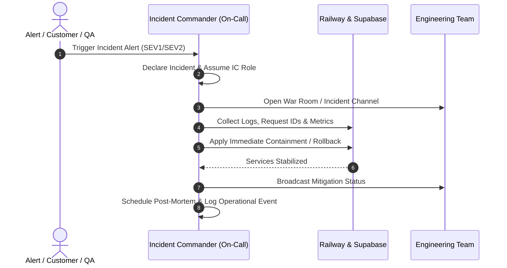

# Incident Response Playbook — Selfcare Sinners Platform

**Document ID**: `RUNBOOK-INCIDENT-001`
**Domain**: Observability & Incident Management
**Audience**: On-Call Engineers, Engineering Leadership, Customer Support Leads
**Related Findings**: [`AUD-OBS-012`](file:///C:/Users/Lucilfer/Documents/Stable-Ecommerce-Orchestrator/results/repo-audit/AUDIT_FINDINGS_REGISTER.md#aud-obs-012)
**Status**: Authoritative Active Playbook

---

## 1. Severity Classification Matrix

| Level | Severity Name | Operational Definition & Criteria | Target Triage Time | Target Mitigation Time |
| :---: | :--- | :--- | :---: | :---: |
| **SEV1** | **Critical Outage** | - Storefront checkout completely non-functional.<br>- Stripe payment intents failing universally.<br>- Customer data breach, IDOR, or authentication compromise.<br>- Database unreachable or corrupting orders. | **< 15 minutes** | **< 1 hour** |
| **SEV2** | **Degraded Service** | - Order placement works, but fulfillment or confirmation emails fail.<br>- Customer profile or order tracking route down.<br>- Admin console inaccessible to store operators.<br>- Elevated API response latency (>2500ms). | **< 30 minutes** | **< 4 hours** |
| **SEV3** | **Minor Defect** | - Non-blocking frontend styling or visual glitches.<br>- Non-critical telemetry logging errors.<br>- Background worker delay not impacting customer orders.<br>- SEO or metadata tag misalignments. | **< 4 hours** | **Next sprint / release** |

---

## 2. Incident Response Workflow



### 2.1 Phase 1: Triage & Identification
1. **Declare Incident Level**: On-call engineer assigns SEV1, SEV2, or SEV3.
2. **Collect Primary Evidence**:
   - Check container logs for unhandled errors.
   - Record representative `requestId` values from failed client requests.
   - Query `/api/admin/diagnostics` for systemic status and error counts.
   - Query `/api/readiness` for database health.

### 2.2 Phase 2: Containment & Mitigation
The primary goal of Phase 2 is **restoring customer functionality**, not implementing the final permanent bugfix.

- If caused by the most recent deployment: Execute [ROLLBACK_RUNBOOK.md](ROLLBACK_RUNBOOK.md).
- If caused by payment gateway issues: Verify Stripe status (`https://status.stripe.com`) and consult [PRODUCTION_RUNBOOK.md](PRODUCTION_RUNBOOK.md#41-paid-order-not-finalized--stripe-webhook-processing-failure).
- If caused by database lock contention: Terminate blocking sessions in Supabase.

### 2.3 Phase 3: Resolution & Verification
1. Verify system health via:
   ```bash
   curl -s https://<production-domain>/api/health
   curl -s https://<production-domain>/api/readiness
   ```
2. Run automated validation:
   ```powershell
   ./scripts/qa/validate-fast.ps1
   ```
3. Confirm that customer order placement succeeds end-to-end.

### 2.4 Phase 4: Post-Mortem & Follow-Up
Within 48 hours of any SEV1 or SEV2 incident:
1. Conduct a blameless post-mortem meeting.
2. Identify:
   - Root cause (technical and operational).
   - Time to detect (TTD) and time to resolve (TTR).
   - What went well, what went poorly, where were we lucky.
3. File actionable Jira engineering tickets for preventive fixes.

---

## 3. Communication Protocols & Templates

### 3.1 External Customer Support Advisory
```text
INCIDENT STATUS: INVESTIGATING
Severity: SEV1
Impact: Customers currently experiencing checkout delays or payment errors.
Action Taken: Engineering is actively investigating payment gateway connections.
Next Update: 30 minutes.
```

### 3.2 Internal Technical Resolution Announcement
```text
INCIDENT RESOLVED: SEV1 Checkout Outage
Start Time: YYYY-MM-DD HH:MM UTC
Resolution Time: YYYY-MM-DD HH:MM UTC
Root Cause: Transient database connection pool saturation.
Mitigation: Railway container restarted, idle connection timeout reduced.
Follow-up: Ticket filed for connection pool scaling and query indexing.
```
