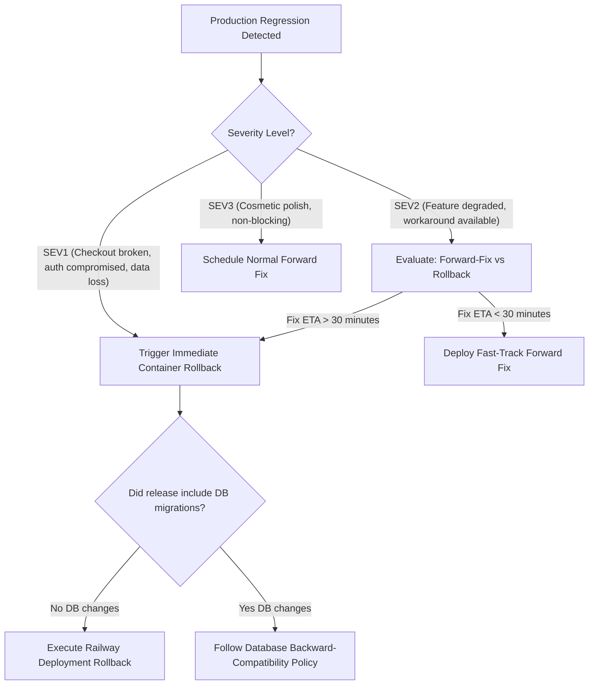

# Rollback Runbook — Selfcare Sinners Platform

**Document ID**: `RUNBOOK-ROLLBACK-001`
**Domain**: Observability & Release Operations
**Audience**: On-Call Engineers, Release Managers, Site Reliability Engineers
**Related Findings**: [`AUD-OBS-012`](file:///C:/Users/Lucilfer/Documents/Stable-Ecommerce-Orchestrator/results/repo-audit/AUDIT_FINDINGS_REGISTER.md#aud-obs-012)
**Status**: Authoritative Active Runbook

---

## 1. Rollback Governance & Decision Framework

When a production defect or regression is identified following a deployment:



### 1.1 Non-Negotiable Invariants During Rollbacks
1. **Never Delete Live Stripe Events**: Do not truncate or delete rows from `stripe_events` or `order_payments`. Unprocessed events must remain intact for replay.
2. **Never Drop Live Columns in Production**: Database migrations must remain backward-compatible with the preceding code version.
3. **Audit Trail Preservation**: All emergency actions must be documented in incident response logs.

---

## 2. Railway Container Rollback Procedure

Executing a container deployment rollback on Railway restores the preceding production container build within 60–90 seconds.

### 2.1 Step-by-Step Execution
1. **Navigate to Railway Deployments**:
   - Access: `https://railway.com/project/<project-id>/service/<service-id>`
   - Click on the **Deployments** tab.
2. **Locate Last Known-Healthy Deployment**:
   - Identify the deployment that was running prior to the failed release.
   - Cross-check the deployment's Git Commit SHA against the release changelog.
3. **Trigger Rollback**:
   - Click the three dots (`...`) on the target deployment row.
   - Select **Rollback to this deployment** (or **Redeploy**).
4. **Monitor Startup & Health Ingress**:
   - Watch the build log stream until: `Server running on port <port>`.
   - Confirm healthy response from public endpoints:
     ```bash
     curl -s https://<production-domain>/api/health
     curl -s https://<production-domain>/api/readiness
     ```
5. **Verify Reverted Git Commit**:
   - Confirm that the `commit` field in `/api/health` matches the known-good commit SHA.

---

## 3. Database Migration Rollback Policy

The database follows a strict **Expand/Contract & Forward-Fix Policy**:

### 3.1 Policy Rules
- **Prefer Forward Fixes**: In 95% of cases, applying an incremental forward migration (e.g. `ALTER TABLE ... DROP CONSTRAINT`, `CREATE INDEX IF NOT EXISTS`) is safer than running destructive rollback scripts.
- **Additive Migrations Invariant**: All migrations deployed to production must be strictly additive (new tables, new nullable columns, new views). Dropping or renaming columns in active use is prohibited.

### 3.2 Emergency Schema Rollback Procedure (When Forward Fix Is Inviable)
If a corrupting migration introduces schema-level locking or broken constraints that cannot be resolved via forward patch:

1. **Stop Incoming Traffic**:
   - Temporarily enable maintenance mode or restrict public API access to prevent concurrent data divergence.
2. **Take Immediate Point-in-Time Dump**:
   ```bash
   # Using Supabase CLI or pg_dump
   supabase db dump --data-only > emergency-pre-rollback-data.sql
   ```
3. **Execute Revert Script in Staging**:
   - Apply the targeted down-migration SQL to the staging replica.
   - Validate that table constraints and foreign keys remain consistent:
     ```powershell
     ./scripts/qa/database/validate-database-security.ps1
     ```
4. **Apply to Production with Dual Sign-Off**:
   - Only execute after Tech Lead and Platform Lead review.

---

## 4. Post-Rollback Verification & Reconciliation

Immediately following container rollback:

1. **Execute Automated Smoke Suite**:
   ```powershell
   ./scripts/qa/validate-fast.ps1
   ```
2. **Check Diagnostic Endpoint**:
   - Access `/api/admin/diagnostics`.
   - Ensure `status` returns `ok`.
3. **Reconcile Webhooks Created During Incident Window**:
   - Inspect `stripe_events` for any events received during the degraded window:
     ```sql
     SELECT id, type, processed_at, error_message
     FROM stripe_events
     WHERE created_at >= NOW() - INTERVAL '1 hour'
       AND (processed_at IS NULL OR error_message IS NOT NULL);
     ```
   - Replay any unprocessed webhook events from the Stripe Dashboard.
4. **Communicate Resolution**:
   - Notify the engineering team and update incident status in the team channel.
