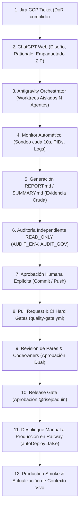

# Workflow Diario de Ingeniería — Jira, Worktrees, Antigravity y ChatGPT Web

**Estado:** Documento operativo canónico de ejecución diaria.
**Autoridad de Gobierno:** `docs/engineering/TEAM_DEVELOPMENT_WORKFLOW.md` (`GOV-ENG-001`), `EVIDENCE_MODEL.md` (`GOV-ENG-005`), `CHANGE_CONTROL.md` (`GOV-ENG-006`), `SHARED_OWNERSHIP_RULES.md` (`GOV-ENG-007`) y contratos congelados en `docs/engineering/client-01/`.
**Principio Fundamental:** Este documento describe la *mecánica de operación diaria*; no altera los contratos congelados ni reduce los hard gates de ingeniería.

---

## 1. El Ciclo de Operación Diaria (De Concepción a Despliegue)

El desarrollo del proyecto opera mediante un flujo coordinado y estrictamente auditado:



### Paso 1: Ticket Jira y Definición de Listo (DoR)
- Selección del ticket activo en Jira (e.g. `CCP-43`, `CCP-39`).
- Verificación de que el ticket cumple al 100% la Definition of Ready (`ENGINEER_READY_CHECKLIST.md`).
- Asignación estricta al responsable de dominio según `.github/CODEOWNERS`.

### Paso 2: Diseño y Razonamiento en ChatGPT Web
- ChatGPT Web actúa como cerebro de arquitectura, diseño, diagnóstico y revisión de código.
- Analiza `ASSISTANT_START_HERE.md`, los contratos congelados y los archivos afectados.
- Prepara la especificación técnica y empaqueta la tarea en un **archivo ZIP versionado** con las instrucciones precisas para los agentes ejecutores locales.

### Paso 3: Orquestación Local con Antigravity CLI (`agy`)
- El orquestador reside en un directorio externo: `Stable-Ecommerce-Orchestrator` (**nunca dentro del repo de producto**).
- Crea Git worktrees aislados (`git worktree add -b <rama> <ruta> origin/main`) a partir de un SHA base verificado en vivo.
- Lanza $N$ agentes autónomos de Antigravity CLI en paralelo sobre directorios y archivos sin colisión.
- **Límite de WIP Humano**: Estrictamente **1 Ticket Principal Activo + 1 Ticket Secundario No Bloqueante** por ingeniero. Dentro de la misma wave de un ticket, pueden convivir $N$ agentes trabajando en ramas aisladas.

### Paso 4: Monitor de Ejecución (Sondeo cada 10 segundos)
- En una ventana independiente de PowerShell se corre el monitor del orquestador.
- Consulta el estado de los agentes cada 10 segundos (`refresh 10s`).
- Captura de forma determinista: PID del proceso, timestamp de inicio y fin, exit code, consumo de memoria y estado terminal.

### Paso 5: Evidencia Cruda: `REPORT.md` y `SUMMARY.md`
- Cada agente escribe su `REPORT.md` en una ruta de resultados **fuera del repositorio de producto**.
- Contenido obligatorio del reporte:
  - Archivos inspeccionados o modificados (rutas exactas y líneas).
  - Comandos ejecutados con su exit code y salida relevante stdout/stderr.
  - Resultados de tests y linting.
  - Declaración de impacto documental (`DOC_IMPACT`).
- El orquestador consolida los reportes en `SUMMARY.md`.
- **Regla Inflexible**: Un exit code `0` o la existencia física de `SUMMARY.md` **NO es prueba de PASS**. Estados como `BLOCKED_PERMISSION`, `INTERRUPTED`, `NOT_VERIFIED` o `REVIEW_REQUIRED` representan bloqueos que impiden avanzar.

### Paso 6: Auditoría Independiente y Control de Integración
- Agentes de auditoría especializados operan en modo **`READ_ONLY`** (e.g. `AUDIT_ENV`, `AUDIT_GOV`) para evaluar el entorno y la gobernanza sin alterar el código.
- Los cambios de múltiples agentes solo se fusionan en un worktree de integración tras resolver colisiones.
- Se ejecutan los gates de verificación rápida:
  ```powershell
  powershell -NoProfile -ExecutionPolicy Bypass -File .\scripts\qa\validate-fast.ps1
  ```
  *(Nota: Para correr tests dentro de un worktree, se debe ejecutar un `npm ci` aislado previo).*

### Paso 7: Aprobación Humana Mandatoria y División de Autoridad
- **Principio de Soberanía**: Conforme a la decisión `D-2026-10-02-01`, los agentes autónomos de Antigravity (`agy`) ejecutan exclusivamente tareas rutinarias de implementación local (lectura, edición de código, suites de pruebas, gates de calidad y compilación de reportes técnicos crudos).
- **Mutaciones Sensibles Exclusivas de Autoridad Humana**: Ningún agente autónomo tiene permiso para realizar mutaciones remotas, de infraestructura o de repositorio central. **Se requiere autorización y ejecución humana explícita** para:
  - Hacer `git commit`
  - Hacer `git push`
  - Crear Pull Request (`gh pr create` o interfaz web)
  - Aprobar o fusionar PRs (Codeowners)
  - Ejecutar transiciones de estado en Jira
  - Modificar configuraciones o reglas de ramas en GitHub
  - Realizar mutaciones en base de datos o consola de Railway
  - Disparar despliegues a producción


### Paso 8: Pull Request y Hard Gates de CI
- Apertura del PR con la plantilla estándar `.github/PULL_REQUEST_TEMPLATE.md` vinculando el ticket Jira.
- Ejecución ineludible de los Hard Gates en GitHub Actions (`.github/workflows/quality-gate.yml`):
  1. `npm run lint` (TypeScript estricto)
  2. `npm test` (Pruebas unitarias)
  3. `npm run build` (Build de producción)
  4. Escaneo de secretos locales (`scan-local-secrets.ps1`)
  5. Regresiones núcleo (`validate-regression-core.ps1`)
  6. Línea base de seguridad (`validate-security-baseline.ps1`)
  7. **Continuidad documental** (`TEST-DOC-IMPACT.ps1 -Mode Committed`, dimensión `doc_continuity` en PL20; verificado localmente con `-Mode WorkingTree` durante desarrollo o `-Mode Committed` antes de abrir PR)
  8. E2E Playwright (`npm run test:e2e` en job `e2e`)

### Paso 9: Revisión de Pares y Aprobación de Codeowners
- Revisión obligatoria por los propietarios de dominio (`@risejoaquin`, `@bonjourrog`, `@Julian716`).
- PRs cross-cutting requieren mínimo 2 aprobaciones.

### Paso 10: Release Gate y Despliegue a Producción en Railway
- La autoridad de release (`@risejoaquin`) verifica staging y autoriza el despliegue.
- > [!IMPORTANT]
  > **El merge a `main` NO despliega a producción**:
  > En fecha 2026-10-01 se confirmó que el auto-deploy en el servicio de producción de Railway está desactivado (`autoDeploy: false`).
  > Tras el merge en GitHub, el Technical Authority debe desencadenar manualmente el despliegue desde el panel o CLI de Railway.

### Paso 11: Production Smoke y Cierre Documental
- Ejecución del script de validación de producción:
  ```powershell
  powershell -NoProfile -ExecutionPolicy Bypass -File .\scripts\qa\validate-production.ps1
  ```
- Actualización mandatoria de `LIVING_CONTEXT.md` y `DECISION_LOG.md` reflejando el cierre del ciclo.

---

## 2. Distinción Rigurosa: Fases Planeadas vs Fases Verificadas

Para evitar falsas afirmaciones de completitud, todo colaborador y asistente debe distinguir taxativamente entre lo planeado y lo verificado:

| Estado de Fase | Definición Operativa | Ejemplo Concreto (Web POS CCP-43) |
|---|---|---|
| **Fase Verificada (VERIFIED)** | Código implementado, suites unitarias pasando, mock contracts validados con exit code 0 y evidencia determinista capturada. | **CCP-43 Fase A**: UI de terminal POS, catálogo de venta, carrito de compra e interfaz de pago validados exclusivamente con mocks en memoria. |
| **Fase Planeada (PLANNED / DRAFT)** | Especificaciones, interfaces o contratos diseñados pero cuya implementación depende de componentes upstream no finalizados. | **CCP-43 Fase B**: Integración en vivo con `POST /api/pos/sales`, RPC de stock decrement y base de datos real. Bloqueada formalmente hasta la conclusión y release de CCP-39, 12, 13, 14 y 22. |

> **Regla Inflexible**: Está estrictamente prohibido marcar una tarea o ticket como "Done" en Jira basándose únicamente en pruebas de mocks si la fase de integración real sigue pendiente.

---

## 3. Manejo Seguro de Git Worktrees

Comandos permitidos de inspección sin efectos secundarios:

```powershell
# Inspeccionar worktrees activos
git worktree list

# Comprobar estado del worktree actual
git status --short

# Comprobar último commit en origin/main
git rev-parse origin/main
```

### Reglas de Higiene en Worktrees:
1. **No borrar carpetas `.git/worktrees/` a mano**: Usar siempre `git worktree remove <ruta>` o solicitar autorización.
2. **Cuidado con bloqueos de procesos**: Asegurarse de que ninguna terminal o proceso de Node.js tenga tomado el directorio antes de intentar desmontar un worktree.
3. **Aislamiento de `node_modules`**: Cada worktree que requiera ejecutar pruebas debe ejecutar su propio `npm ci`.

---

## 4. Política de Reversión (Rollback) y Seguridad Externa

Toda operación que cause efectos externos (Railway, GitHub Settings, Jira, Supabase) debe seguir la regla **Consulta Previa → Modificación Mínima → Verificación Posterior**:

1. **Pre-check**: Consultar y registrar el estado del recurso antes de actuar (e.g. `railway whoami`, lectura de reglas).
2. **Respaldo / Plan de Reversión**: Disponer del comando o script exacto para deshacer el cambio si la operación falla.
3. **Post-check**: Confirmar mediante consulta directa que el nuevo estado se aplicó correctamente.
4. **Si el estado es incierto o falla la red**: **DETENERSE**. No reintentar mutaciones a ciegas ni adivinar parámetros.

---

## 5. Decisiones Fuera de Git y Continuidad Documental

Las decisiones acordadas en chat, tickets de Jira o consolas de infraestructura no dejan rastro en el historial de Git.
**Obligación Operativa**: Todo cambio de infraestructura, decisión arquitectónica o actualización de workflow debe acompañarse de un Pull Request puramente documental en `risejoaquin/stable-ecomerce` que incorpore la entrada correspondiente en `docs/team/DECISION_LOG.md` y actualice `docs/team/LIVING_CONTEXT.md` conforme a la política `GOV-DOC-001`.
